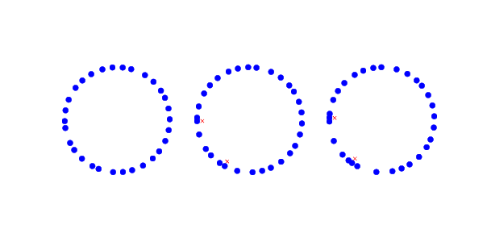

# 十、兽群、鸟群和交通堵塞

本章的代码位于`chap10.ipynb`中，它是本书仓库中的 Jupyter 笔记本。使用此代码的更多信息，请参见第？节。

## 10.1 交通堵塞

是什么导致交通堵塞？在某些情况下，有明显的原因，如事故，车速监视或其他干扰交通的事情。 但其他时候，交通堵塞似乎没有明显的原因。

基于智能体的模型有助于解释自发性交通拥堵。 例如，我根据 Resnick，海龟，白蚁和交通堵塞模型实现了一个简单的高速路模拟。

这是代表“高速路”的类：

```py
class Highway:

    def __init__(self, n=10, length=1000, eps=0):
        self.length = length
        self.eps = eps

        # create the drivers
        locs = np.linspace(0, length, n, endpoint=False)
        self.drivers = [Driver(loc) for loc in locs]

        # and link them up
        for i in range(n):
            j = (i+1) % n
            self.drivers[i].next = self.drivers[j]
```

`n`是汽车的数量。

`length`是高速路的长度，默认为 1000（以任意单位）。

`eps`是我们将添加到系统中的随机噪声。

`loc`包含驾驶员的位置；最初它们沿着高速公路等距分布。

驾驶员由`Driver`对象表示。 每个驾驶员都包含前方驾驶员的引用。 高速公路是圆形的，所以最后的驾驶员可以引用第一个。

`step`方法简单；它只是移动每个驾驶员：

```py
def step(self):
    for driver in self.drivers:
        self.move(driver)
```

这里是`move `方法：

```py
def move(self, driver):
    d = self.distance(driver)

    # let the driver choose acceleration
    acc = driver.choose_acceleration(d)
    acc = min(acc, self.max_acc)
    acc = max(acc, self.min_acc)
    speed = driver.speed + acc

    # add random noise to speed
    speed *= np.random.uniform(1-self.eps, 1+self.eps)

    # keep it nonnegative and under the speed limit
    speed = max(speed, 0)
    speed = min(speed, self.speed_limit)

    # if current speed would collide, stop
    if speed > d:
        speed = 0

    # update speed and loc
    driver.speed = speed
    driver.loc += speed
```

`d`是驾驶员与前方驾驶员之间的距离。 这个距离被传递给`choose_acceleration`，它规定了驾驶员的行为。 这是司机做出的唯一决定; 其他一切都由模拟的“物理”决定。

+   `acc`是加速度，它受`min_acc`和`max_acc`限制。 在我的实现中，汽车可以在`max_acc = 1`时加速，在`min_acc = -10`时加速。
+   `speed`是旧的速度加上请求的加速度，但是我们做了一些调整。 首先，我们向速度添加了随机噪音，因为这个世界并不完美。 `eps`决定了噪音的幅度，这是适用于速度的百分比; 例如，如果`eps`为 0.02，则速度乘以 98% 到 102% 之间的随机数。
+   然后速度限制在 0 到`speed_limit`之间，在我的实现中为 40，所以汽车不允许后退或加速。
+   如果请求的速度会引起与下一辆车的碰撞，则速度设置为 0。
+   最后，我们更新驾驶员的速度和`loc`属性。

以下是`Driver`类的定义：

```py
class Driver:

    def __init__(self, loc, speed=0):
        self.loc = loc
        self.speed = speed

    def choose_acceleration(self, d):
        return 1
```

`loc`和`speed `属性是驾驶员的位置和速度。

`choose_acceleration`的这个实现非常简单：它总是以最大速率加速。

由于汽车起步距离相等，因此我们预计它们都会加速，直到达到限速，或者直到它们的速度超过它们之间的距离。 此时，至少会发生一次“碰撞”，导致一些汽车停下来。



图 10.1：三个时间点中，环形公路上的驾驶员的模拟。 点表示驾驶员的位置；十字表示驾驶员必须刹车来避开另一个驾驶员。

图？展示了该过程中的几个步骤，从 30 辆汽车和`eps = 0.02`开始。 左边是 16 个时间步后的状态，汽车排列成一圈。 由于随机噪音，有些汽车比其他汽车要快，并且间距变得不均匀。

在下一个时间步骤（中），两辆车相撞，用`x`标记表示。

在下一个时间步骤（右），两辆汽车会与已停车的汽车碰撞，我们可以看到最初形成的交通堵塞。 一旦堵塞形成，它就会持续下去，其它汽车从后面靠近并碰撞，而前面的汽车加速离开。

在某些情况下，堵塞本身会向后传播，如果你观看本章的笔记本中的动画，您可以看到它。

