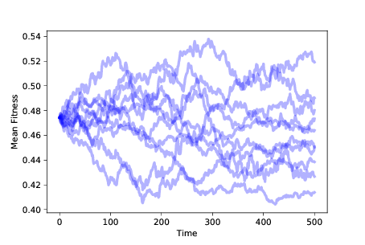

## 十一、进化

生物学乃至整个科学最重要的思想，是通过自然选择的进化论，它声称由于自然选择而创造出新的物种并改变现有的物种。自然选择是个体间遗传差异导致生存和繁殖差异的过程。

在了解生物学的人中，进化论被广泛认为是一个事实，也就是它足以接近事实，如果将来得到纠正，纠正将使中心思想基本保持完整。

尽管如此，许多人并不相信进化论。在皮尤研究中心进行的一项调查中，被调查者被问到，以下哪些断言更贴近他们的观点：

+   人类和其他生物随着时间的推移而进化。
+   起初，人类和其他生物就以其现在的形式存在。

约有 34% 的美国人选择了第二个（见 <http://www.thearda.com/Archive/Files/Codebooks/RELLAND14_CB.asp>）。

即使在那些认为生物已经进化的人中，只有一半以上的人认为进化的原因是自然选择。 换句话说，只有三分之一的美国人相信进化论是真实的。

这怎么可能？ 在我看来，促成因素包括：

+   有些人认为进化论与他们的宗教信仰之间有冲突。 感觉就像他们不得不拒绝一个，他们拒绝了进化论。
+   其他人经常被第一组成员积极误导，以至于他们对进化论的许多认识都是错误的。
+   许多人根本就不了解进化。

对于第一组，我可能没有太多可以做的事，但我认为我可以帮助其他人。 经验上，进化论很难让人理解。 同时，它非常简单：对很多人来说，一旦他们了解进化论，它似乎既明显又无可辩驳。

为了帮助人们从困惑转变为清晰，我找到的最强大的工具就是计算。 我们看到，理论上很难理解的想法，在模拟中出现时很容易理解。 这是本章的目标。

本章的代码位于`chap11.ipynb`中，该书是本书仓库中的 Jupyter 笔记本。使用此代码的更多信息，请参见第？节。

## 11.1 简单的进化

我将从一个简单的模型开始，演示一种基本的进化形式。 根据该理论，以下特征足以产生进化：

+   复制者：我们需要一批能够以某种方式复制的智能体。 我们将以复制者开始，它们生成它们自己的完美的副本。 稍后我们将添加不完美的副本，即变异。
+   变异：我们还需要一些总体中的变化，也就是个体之间的差异。
+   生存和繁殖差异：个体之间的差异必须影响其生存或繁殖的能力。

为了模拟这些特征，我们将定义智能体种群，智能体代表个体。 每个智能体都有遗传信息，称为基因型，这是智能体繁殖时复制的信息。 在我们的模型 1 中，基因型由`N`个二进制数字（零和一）的序列表示，其中`N`是我们选择的参数。

为了产生变异，我们创建了具有多种基因型的种群；稍后我们将探讨创造或增加变异的机制。

最后，为了产生生存和繁殖差异，我们定义了一个函数，将每个基因型映射为一个适应度，其中适应度是一个数量，有关智能体的生存或繁殖能力。

## 11.2 适应性景观

将基因型映射为适应性函数，称为适应性景观。 在景观的隐喻中，每个基因型对应于`N`维空间中的一个位置，并且适应性对应于该位置处的景观的“高度”。对于能够解释这个隐喻的可视化，参见 <https://en.wikipedia.org/wiki/Fitness_landscape>。

在生物学术语中，适应性景观代表一种信息，它是生物体的基因型与其物理形式和能力的关系，后者称为其表现型，以及表现型如何与其环境相互作用。

在现实世界中，适应性景观很复杂，但我们不需要建立现实模型。 为了诱导进化，我们需要基因型和适应性之间的某种关系，但事实证明它可以是任何关系。 为了证明它，我们将使用完全随机的适应性景观。

这是代表适应性景观的类的定义：

```py
class FitnessLandscape:
    def __init__(self, N):
        self.N = N
        self.one_values = np.random.random(N)
        self.zero_values = np.random.random(N)

    def fitness(self, loc):
        fs = np.where(loc, self.one_values,
                           self.zero_values)
        return fs.mean()
```

智能体的基因型，对应其在适应性景观中的位置，由一个 NumPy 的零一数组来表示，称为`loc`。 给定基因型的适应性，是`N`个适应性贡献的平均值，`loc`的每个元素都是一个。

为了计算基因型的适应性，`FitnessLandscape`使用两个数组：`one_values`，其中包含`loc`的每个元素都为 1 时的适应性贡献，以及`zero_values`，其中包含为 0 时的适应度贡献。

`fitness`方法使用`np.where`，如果`loc`中的值为 1，它从`one_values`中选择一个值，如果`loc`中的值为 0，它从`zero_values`中选择一个值。

例如，假设`N=3`：

```py
one_values =  [0.1, 0.2, 0.3]
zero_values = [0.4, 0.7, 0.9]
```

这种情况下，`loc = [0, 1, 0]`的适应性是`[0.4, 0.2, 0.9]`的均值，为 0.5。

## 11.3 智能体

接下来我们需要智能体，这是类定义：

```py
class Agent:

    def __init__(self, loc, fit_land):
        self.loc = loc
        self.fit_land = fit_land
        self.fitness = fit_land.fitness(self.loc)

    def copy(self):
        return Agent(self.loc, self.fit_land)
```

智能体的属性是：

`loc`：智能体在适应性景观中的位置。
`fit_land`：`FitnessLandscape`对象的引用。
`fitness`：智能体在`FitnessLandscape`中的适应性，表示为 0 到 1 之间的数字。
`Agent`的这个定义提供了一种简单的`copy`方法，可以精确复制基因型；之后，我们将看到一个带有突变的版本，但突变对于进化来说不是必需的。

## 11.4 模拟

现在我们有了智能体和适应性景观，我将定义一个名为`Simulation`的类，用于模拟智能体的创建，繁殖和死亡。 为了避免陷入困境，我将在这里提供一个简化版本的代码；你可以在本章的笔记本上看到细节。

这是`Simulation`的定义：

```py

class Simulation:

    def __init__(self, fit_land, agents):
        self.fit_land = fit_land
        self.agents = agents
```

`Simulation`的属性是：

+   `fit_land`：`FitnessLandscape`对象的引用。
+   `agents`：`Agent`对象的数组。

`Simulation`中最重要的函数是`step`，它模拟了单个时间步骤：

```py

# class Simulation:

    def step(self):
        n = len(self.agents)
        fits = self.get_fitnesses()

        # see who dies
        index_dead = self.choose_dead(fits)
        num_dead = len(index_dead)

        # replace the dead with copies of the living
        replacements = self.choose_replacements(num_dead, fits)
        self.agents[index_dead] = replacements
```

在每个时间步骤中，一些智能体死亡，一些智能体繁殖。 `step`使用另外三个方法：

+   `get_fitnesses`返回一个数组，包含每个智能体的适应性，按照它们在智能体数组中出现的顺序。
+   `choose_dead`决定哪些智能体在此时间步中死亡，并返回一个数组，包含死亡智能体的索引。
+   `choose_replacements`决定哪些智能体在此时间步中繁殖，在每个智能体上调用`copy`，并返回一个新的`Agent`对象的数组。

在这个版本的模拟中，每个时间步中新智能体的数量等于死亡智能体的数量，所以活动智能体的数量是恒定的。

## 11.5 没有差异

在我们运行模拟之前，我们必须指定`choose_dead`和`choose_replacements`的行为。 我们将从这些函数的简单版本开始，它们不依赖于适应性：

```py
# class Simulation

     def choose_dead(self, fits):
        n = len(self.agents)
        is_dead = np.random.random(n) < 0.1
        index_dead = np.nonzero(is_dead)[0]
        return index_dead

    def choose_replacements(self, n, fits):
        agents = np.random.choice(self.agents, size=n, replace=True)
        replacements = [agent.copy() for agent in agents]
        return replacements
```

在`choose_dead`中，`n`是智能体的数量，`is_dead`是一个布尔数组，对于此时间步骤内死亡的智能体为`True`。 在这个版本中，每个智能体都有相同的死亡概率：0.1。 `choose_dead`使用`np.nonzero`来查找`is_dead`的非零元素的索引（`True`被视为非零）。

在`choose_replacements`中，`n`是在此时间步骤中复制的智能体数量。 它使用`np.random.choice`带替换地选择`n`个智能体。 然后它在每个上调用`copy`，并返回一个新的`Agent`对象列表。

这些方法不依赖于适应性，所以这种模拟没有生存或繁殖差异。 因此，我们不应期待看到进化。 但是，我们怎么辨别呢？

## 11.6 进化的证据

进化的最具包容性的定义是，种群中基因型分布的变化。 进化是一种聚合效应：换句话说，个体不会进化；但种群会。

在这个模拟中，基因型是高维空间中的位置，因此很难将其分布中的变化可视化。 但是，如果基因型改变，我们预计它们的适应性也会改变。 所以我们将将适应性分布的变化用作进化的证据。 具体来说，我们将看看种群中适应性的均值和标准差。

在我们运行模拟之前，我们必须添加一个`Instrument`，它是在每个时间步骤后更新的对象，计算一个感兴趣的统计量，并将结果存储在一个序列中，我们稍后可以绘制它。

这是所有仪器的父类：

```py
class Instrument:
    def __init__(self):
        self.metrics = []
```

下面是`MeanFitness`的定义，`MeanFitness`是一个仪器，计算每个时间步的种群平均适应性：

```py

class MeanFitness(Instrument):
    def update(self, sim):
        mean = np.nanmean(sim.get_fitnesses())
        self.metrics.append(mean)
```

现在我们准备好运行模拟了。 为了最小化起始种群中随机变化的影响，我们使用同一组智能体启动每个模拟。 为了确保我们探索整个适应性景观，我们由每个位置的一个智能体开始。 以下是创建模拟的代码：

```py
N = 8
fit_land = FitnessLandscape(N)
agents = make_all_agents(fit_land, Agent)
sim = Simulation(fit_land, agents)
```

`make_all_agents`为每个位置创建一个智能体； 本章的实现在笔记本中。

现在我们可以创建并添加`MeanFitness`仪器，运行模拟并绘制结果：

```py
instrument = MeanFitness()
sim.add_instrument(instrument)
sim.run()
sim.plot(0)
```

模拟维护了`Instrument`对象列表。 在每个时间步之后，它在列表中的每个仪器上调用`update`。

模拟运行后，我们使用`Simulation.plot`绘制结果，它接受索引作为参数，使用索引从列表中选择一个`Instrument`并绘制结果。 在这个例子中，只有一个`Instrument`，索引为 0。



图 11.1：随着时间的推移，10 次模拟的平均适应性，没有生存或繁殖差异

图？显示了运行这个模拟 10 次的结果。 种群的平均适应性随机移动。 由于适应性的分布随时间变化，我们推断表现型的分布也在变化。 按照最具包容性的定义，这种随机游走是一种进化。 但它不是一个特别有趣的类型。

特别是，这种进化并不能解释生物物种如何随时间变化，或者如何出现新的物种。 进化论是强大的，因为它解释了我们在自然界看到的似乎无法解释的现象：

+   适应性：物种与其环境的相互作用似乎太复杂，太巧妙，并且偶然发生。 自然系统的许多特征看起来好像是设计出来的。
+   增加的多样性：随着时间的推移，地球上的物种数量普遍增加（尽管有几个时期的大规模灭绝）。
+   增加的复杂性：地球上的生命史起始于相对简单的生命形式，后来在地质记录中出现了更复杂的生物体。

这些是我们想要解释的现象。 到目前为止，我们的模型并没有完成这个任务。
