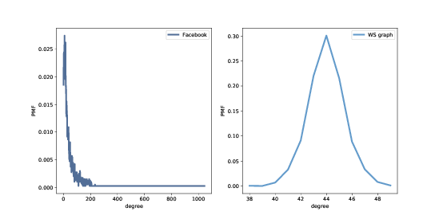
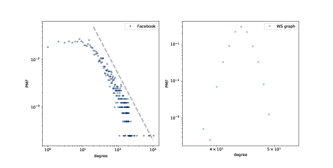
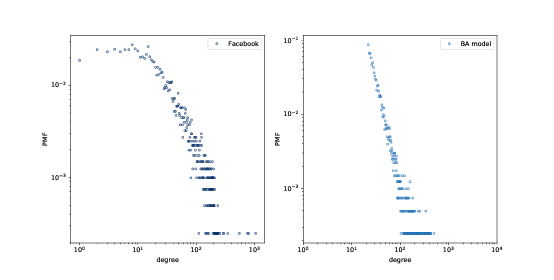
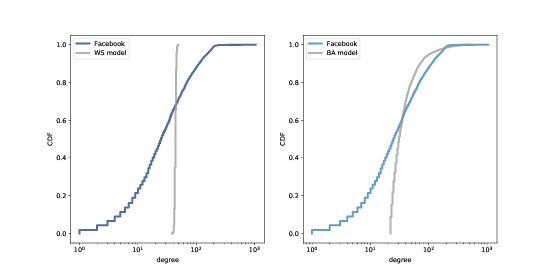
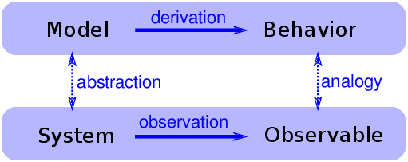

# 四、无标度网络

在本章中，我们将处理来自在线社交网络的数据，并使用 WS 图对其进行建模。WS 模型像数据一样，具有小世界网络的特点，但是与数据不同，它的节点到节点的邻居数目变化很小。

这种差异是 Barabási 和 Albert 开发的网络模型的动机。BA 模型捕捉到邻居数量的观察到的变化，它具有小的世界属性之一，短路径长度，但它没有一个小世界网络的高聚类。

本章最后讨论了 WS 和 BA 图，作为小世界网络的解释模型。

本章的代码位于本书的仓库中的`chap04.ipynb`中。使用代码的更多信息，请参见第（？）章。

## 4.1 社交网络数据

WS 图的目的是，模拟自然科学和社会科学中的网络。Watts 和 Strogatz 在他们最初的论文中，查看了电影演员的网络（如果他们出现在同一部电影中，就是连接的）。美国西部的电网；和 C. elegans 线虫脑中的神经元网络 。他们发现，所有这些网络都具有小世界图的高群聚性和短路径长度特征。

在本节中，我们将使用不同的数据集，Facebook 用户及其朋友的数据集，来进行相同的分析。如果你对 Facebook 不熟悉，那么彼此连接的用户被称为“朋友”，而不管他们在现实世界中的关系的性质如何。

我将使用来自斯坦福网络分析项目（SNAP）的数据，该项目分享了来自在线社交网络和其他来源的大型数据集。具体来说，我将使用他们的 Facebook 数据集 1，其中包括 4039 个用户和 88,234 个朋友关系。该数据集位于本书的仓库中，但也可以从 [SNAP 网站](https://snap.stanford.edu/data/egonets-Facebook.html)上获取。

数据文件为每条边包含一行，用户由 0 到 4038 之间的整数标识。下面是读取文件的代码：

```py

def read_graph(filename):
    G = nx.Graph()
    array = np.loadtxt(filename, dtype=int)
    G.add_edges_from(array)
    return G
```

NumPy 提供了函数`loadtext`，它读取给定的文件，并以 NumPy 数组的形式返回内容。参数`dtype`指定数组元素的类型。

然后我们可以使用`add_edges_from`迭代数组的行，并创建边。结果如下：

```py
>>> fb = read_graph('facebook_combined.txt.gz')
>>> n = len(fb)
>>> m = len(fb.edges())
>>> n, m
(4039, 88234)
```

节点和边的数量与数据集的文档一致。

现在我们可以检查这个数据集是否具有小世界图的特征：高群聚性和短路径长度。

第（？）节中，我们编写了一个函数，来计算网络平均群聚系数。NetworkX 提供了一个叫做的函数`average_clustering`，它可以更快地完成相同的工作。

但是对于更大的图，它们都太慢，需要与`nk^2`成正比的时间，其中`n`是节点数，`k`是每个节点的邻居数。

幸运的是，`NetworkX`提供了一个通过随机抽样来估计群聚系数的函数。你可以像这样调用它：

```py

    from networkx.algorithms.approximation import average_clustering
    average_clustering(G, trials=1000)
```

下面函数对路径长度做了类似的事情：

```py

def random_path_lengths(G, nodes=None, trials=1000):
    if nodes is None:
        nodes = G.nodes()
    else:
        nodes = list(nodes)

    pairs = np.random.choice(nodes, (trials, 2))
    lengths = [nx.shortest_path_length(G, *pair)
               for pair in pairs]
    return lengths
```

`G`是一个图，`nodes`是节点列表，我们应该从中抽样，`trials`是要抽样的随机路径的数量。如果`nodes`是`None`，我们从整个图表中进行抽样。

`pairs`是随机选择的节点的 NumPy 数组，对于每个采样有一行两列。

列表推导式枚举数组中的行，并计算每对节点之间的最短距离。结果是路径长度的列表。

`estimate_path_length`生成一个随机路径长度列表，并返回它们的平均值：

```py

def estimate_path_length(G, nodes=None, trials=1000):
    return np.mean(random_path_lengths(G, nodes, trials))
```

我会使用`average_clustering `来计算`C`：

```py
C = average_clustering(fb)
```

并使用`estimate_path_lengths`来计算`L`：

```py
L = estimate_path_lengths(fb)
```

群聚系数约为`0.61`，这是较高的，正如我们所期望的那样，如果这个网络具有小世界特性。

平均路径为`3.7`，在 4000 多个用户的网络中相当短。毕竟这是一个小世界。

现在让我们看看是否可以构建一个 WS 图，与此网络具有相同特征。

## 4.2 WS 模型

在 Facebook 数据集中，每个节点的平均边数约为 22。由于每条边都连接到两个节点，度的均值是每个节点边数的两倍：

```py

>>> k = int(round(2*m/n))
>>> k
44
```

我们可以用`n=4039`和`k=44`创建一个 WS 图。`p=0`时，我们会得到一个环格。

```py

lattice = nx.watts_strogatz_graph(n, k, 0)
```

在这个图中，群聚较高：`C`是 0.73，而在数据集中是 0.61。但是`L`为 46，远远高于数据集！

使用`p=1`我们得到一个随机图：

```py
random_graph = nx.watts_strogatz_graph(n, k, 1)
```

在随机图中，`L`是 2.6，甚至比数据集（3.7）短，但`C`只有 0.011，所以这是不好的。

通过反复试验，我们发现，当`p=0.05`时，我们得到一个高群聚和短路径长度的 WS 图：

```py

ws = nx.watts_strogatz_graph(n, k, 0.05, seed=15)
```

在这个图中`C`是`0.63`，比数据集高一点，`L`是 3.2，比数据集低一点。所以这个图很好地模拟了数据集的小世界特征。

到现在为止还不错。

## 4.3 度



> 图 4.1：Facebook 数据集和 WS 模型中的度的 PMF。

回想一下，节点的度是它连接到的邻居的数量。如果 WS 图是 Facebook 网络的一个很好的模型，它应该具有相同的总（或平均）度，理想情况下不同节点的度数相同。

这个函数返回图中的度的列表，每个节点对应一项：

```py

def degrees(G):
    return [G.degree(u) for u in G]
```

数据集中的度的均值是 43.7；WS 模型中的度的均值是 44。到目前为止还不错。

但是，WS 模型中的度的标准差为 1.5；数据中的标准差是 52.4。有点糟。

这里发生了什么？为了更好地查看，我们必须看看度的 分布，而不仅仅是均值和标准差。

我将用一个 Pmf 对象来表示度的分布，它在`thinkstats2`模块中定义。Pmf 代表“概率质量函数”；如果你不熟悉这个概念，你可以阅读 Think Stats 第二版的第三章，网址是 <http://greenteapress.com/thinkstats2/html/thinkstats2004.html>。

简而言之，Pmf 是值到概率的映射。Pmf 是每个可能的度`d`，到度为`d`的节点比例的映射。

作为一个例子，我将构建一个图，拥有节点`1, 2, 3`，连接到中心节点`0`：

```py
G = nx.Graph()
G.add_edge(1, 0)
G.add_edge(2, 0)
G.add_edge(3, 0)
nx.draw(G)
```

这里是图中的度的列表：

```py

>>> degrees(G)
[3, 1, 1, 1]
```

节点`0`度为 3，其它度为 1。现在我可以生成一个 Pmf，它表示这个度的分布：

```py
>>> from thinkstats2 import Pmf
>>> Pmf(degrees(G))
Pmf({1: 0.75, 3: 0.25})
```

产生的`Pmf`是一个对象，将每个度映射到一个比例或概率。在这个例子中，75％的节点度为 1，25％度为 3。

现在我们生成一个`Pmf`，包含来自数据集的节点的度，并计算均值和标准差：

```py

>>> pmf_ws = Pmf(degrees(ws))
>>> pmf_ws.mean(), pmf_ws.std()
(44.000, 1.465)
```

我们可以使用`thinkplot`模块来绘制结果：

```py
thinkplot.Pdf(pmf_fb, label='Facebook')
thinkplot.Pdf(pmf_ws, label='WS graph')
```

图（？）显示了这两个分布。他们是非常不同的。

在 WS 模型中，大多数用户有大约 44 个朋友；最小值是 38，最大值是 50。这个变化不大。在数据集中，有很多用户只有 1 或 2 个朋友，但有一个人有 1000 多个！

像这样的分布，有许多小的值和一些非常大的值，被称为重尾。

## 4.4 重尾分布



> 图 4.2：Facebook 数据集和 WS 模型中的度的 PMF，在双对数刻度下。

在复杂性科学的许多领域中，重尾分布是一个常见特征，它们将成为本书的一个反复出现的主题。

我们可以在双对数轴绘制它，来获得重尾分布的更清晰的图像，就像上面那副图那样。这种转换突显了分布的尾巴；也就是较大值的概率。

在这种转换下，数据大致在一条直线上，这表明分布的最大值与概率之间存在“幂律”关系。在数学上，

```
PMF(k) ~ k^(−α)
```

其中`PMF(k)`是度为`k`的节点的比例，`α`是一个参数，符号`~`表示当`k`增加时，PMF 渐近于`k^(−α)`。

如果我们把对两边取对数，我们得到：

```

logPMF(k) ~ −α logk 
```

因此，如果一个分布遵循幂律，并且我们在双对数刻度上绘制`PMF(k)`与`k`的关系，那么我们预计至少对于`k`的较大值，将有一条斜率为`-α`的直线。

所有的幂律分布都是重尾的，但是还有其他重尾分布不符合幂律。我们将很快看到更多的例子。

但首先，我们有一个问题：WS 模型拥有高群聚性和短路径长度，我们在数据中也看到了，但度的分布根本不像数据。这种差异就启发了我们下一个主题，Barabási-Albert 模型。

## 4.5 Barabási-Albert 模型

1999 年，Barabási 和 Albert 发表了一篇论文“随机网络中的标度的出现”（Emergence of Scaling in Random Networks），描述了几个现实世界的网络的结构特征，包含一些图，它们展示了电影演员，万维网（WWW）页面和美国西部电网设施的互联性。您可以从 <http://www.sciencemag.org/content/286/5439/509> 下载该论文。

他们测量每个节点的度并计算`PMF(k)`，即节点度为`k`的比例。然后他们在双对数标度上绘制`PMF(k)`与`k`的关系。这些曲线可用一条直线拟合，至少对于`k`的较大数值；所以他们得出结论，这些分布是重尾的。

他们还提出了一个模型，生成了属性相同的图。模型的基本特征与 WS 模型不同，它们是：

增长：

BA 模型不是从固定数量的顶点开始，而是从一个较小图开始，每次添加一个顶点。

优先连接：

当创建一个新的边时，它更可能连接到一个已经有很多边的节点。这种“富者更富”的效应是一些现实世界网络增长模式的特征。

最后，他们表明，由 Barabási-Albert（BA）模型模型生成的图，度的分布遵循幂律。

具有这个属性的图有时被称为无标度网络，原因我不会解释；如果您好奇，可以在 <http://en.wikipedia.org/wiki/Scale-free_network> 上阅读更多内容。

NetworkX 提供了一个生成 BA 图的函数。我们将首先使用它；然后我会告诉你它的工作原理。

```py
ba = nx.barabasi_albert_graph(n=4039, k=22)
```

参数是`n`要生成的节点数量，`k`是每个节点添加到图形时的起始边数。我选择`k=22`，是因为这是数据集中每个节点的平均边数。



> 图 4.3：Facebook 数据集和 BA 模型中的节点的 PMF，在双对数刻度上。

所得图形拥有 4039 个节点，每个节点有 21.9 个边。由于每条边连接两个节点，度的均值为 43.8，非常接近数据集中的度的均值 43.7。

度的标准差为 40.9，略低于数据集 52.4，但比我们从 WS 图得到的数值好 1.5 倍。

图（？）以双对数刻度展示了 Facebook 网络和 BA 模型的度的分布。模型并不完美；特别`k`是在小于 10 时偏离了数据。但尾巴看起来像是一条直线，这表明这个过程产生了遵循幂律的度的分布。

所以在重现度的分布时，BA 模型比 WS 模型更好。但它有小世界的属性？

在这个例子中，平均路径长度`L`是 2.5，这比实际的网络的`L = 3.69`更小。所以这很好，虽然可能太好了。

另一方面，群聚系数`C`为 0.037，并不接近数据集中的值 0.61。所以这是一个问题。

下表总结了这些结果。WS 模型捕获了小世界的特点，但没有度的分布。BA 模型捕获了度的分布，和平均路径长度，至少是近似的，但没有群聚系数。

在本章最后的练习中，您可以探索其他可以捕获所有这些特征的模型。

|   | Facebook | WS 模型 | BA 模型 |
| --- | --- | --- | --- |
| `C` | 0.61 | 0.63 | 0.037 |
| `L` | 3.69 | 3.23 | 2.51 |
| 度的均值 | 43.7 | 44 | 43.7 |
| 度的标准差 | 52.4 | 1.5 | 40.1 |
| 幂律？ | 可能 | 不是 | 是 |

> 表 4.1：与两个模型相比，Facebook 网络的特征。

## 4.6 生成 BA 图

在前面的章节中，我们使用了 NetworkX 函数来生成BA图。现在让我们看看它的工作原理。这是一个`barabasi_albert_graph`的版本，我做了一些更改，使其更易于阅读：

```py
def barabasi_albert_graph(n, k):

    G = nx.empty_graph(k)
    targets = list(range(k))
    repeated_nodes = []

    for source in range(k, n):

        G.add_edges_from(zip([source]*k, targets))

        repeated_nodes.extend(targets)
        repeated_nodes.extend([source] * k)

        targets = _random_subset(repeated_nodes, k)

    return G
```

`n`是我们想要的节点的数量，`k`是每个新节点边的数量（近似为每个节点的边的数量）。

我们从一个`k`个节点和没有边的图开始。然后我们初始化两个变量：

`targets`：

`k`个节点的列表，它们将被连接到下一个节点。最初`targets`包含原来的`k`个节点；之后它将包含节点的随机子集。

`repeated_nodes`：

一个现有节点的列表，如果一个节点有`k`条边，那么它出现`k`次。当我们从`repeated_nodes`选择时，选择任何节点的概率与它所具有的边数成正比。

每次循环中，我们添加源节点到`targets`中的节点的边。然后我们更新`repeated_nodes`，通过添加每个目标一次，以及新的节点`k`次。

最后，我们选择节点的子集作为下一次迭代的目标。以下是`_random_subset`的定义：

```py

def _random_subset(repeated_nodes, k):
    targets = set()
    while len(targets) < k:
        x = random.choice(repeated_nodes)
        targets.add(x)
    return targets
```

每次循环中，`_random_subset`从`repeated_nodes`选择，并将所选节点添加到`targets`。因为`targets`是一个集合，它会自动丢弃重复项，所以只有当我们选择了`k`不同的节点时，循环才会退出。

## 4.7 累积分布函数（CDF）



> 图 4.4：Facebook 数据集中的度的 CDF，以及 WS 模型（左边）和 BA 模型（右边），在双对数刻度上。

图 4.3 通过在双对数刻度上绘制概率质量函数（PMF）来表示度的分布。这就是 Barabási 和 Albert 呈现他们的结果的方式，这是幂律分布的文章中最常使用的表示。但是，这不是观察这样的数据的最好方法。

更好的选择是累积分布函数 （CDF），它将`x`值映射为小于或等于`x`的值的比例。

给定一个 Pmf，计算累积概率的最简单方法是将`x`的概率加起来，包括`x`：

```py

def cumulative_prob(pmf, x):
    ps = [pmf[value] for value in pmf if value<=x]
    return sum(ps)
```

例如，给定数据集中的度的分布，`pmf_pf`，我们可以计算好友数小于等于 25 的比例：

```py

>>> cumulative_prob(pmf_fb, 25)
0.506
```

结果接近 0.5，这意味着好友数的中位数约为 25。

因为 CDF 的噪音比 PMF 少，所以 CDF 更适合可视化。一旦你习惯了 CDF 的解释，它们可以提供比 PMF 更清晰的分布图像。

`thinkstats`模块提供了一个称为`Cdf`的类，代表累积分布函数。我们可以用它来计算数据集中的度的 CDF。

```py

from thinkstats2 import Cdf
cdf_fb = Cdf(degrees(fb), label='Facebook')
```

`thinkplot`提供了一个函数，叫做`Cdf`，绘制累积分布函数。

```py

thinkplot.Cdf(cdf_fb)
```

图 4.4 显示了 Facebook 数据集的度的 CDF ，以及 WS 模型（左边）和 BA 模型（右边）。`x`轴是对数刻度。

显然，WS 模型和数据集的 CDF 很大不同。BA 模式更好，但还不是很好，特别是对于较小数值。

在分布的尾部（值大于 100），BA 模型看起来与数据集匹配得很好，但是很难看出来。我们可以使用另一个数据视图，更清楚地观察数据：在对数坐标上绘制互补 CDF。

互补 CDF（CCDF）定义为：

```

CCDF(x) = 1 − CDF(x) 
```

它很有用，因为如果 PMF 服从幂律，CCDF 也服从：

```
CCDF(x) =(x/x_m)^(-α)
```

其中`x_m`是最小可能值，`α`是确定分布形状的参数。

对两边取对数：

```

logCCDF(x) = −α (logx − logx_m) 
```

因此，如果分布服从幂定律，在双对数刻度上，我们预计 CCDF 是斜率为`-α`的直线。

图 4.5 以双对数刻度显示 Facebook 数据的度的 CCDF，以及 WS 模型（左边）和 BA 模型（右边）。

通过这种查看数据的方式，我们可以看到 BA 模型与分布的尾部（值大于 20）匹配得相当好。WS 模型没有。

## 4.8 解释性模型



> 图 4.6：解释性模型的逻辑结构

我们以 Milgram 的小世界实验开始讨论网络，这表明社交网络中的路径长度是惊人的小；因此，有了“六度分离”。

当我们看到令人惊讶的事情时，自然会问“为什么”，但有时候我们不清楚我们正在寻找什么样的答案。一种答案是解释性模型（见图 4.6）。解释性模型的逻辑结构是：

1.  在一个系统`S`中，我们看到一些可观察的东西`O`，值得解释。

2.  我们构建一个与系统类似的模型`M`，也就是说，模型与系统之间的元素/组件/原理是对应的。

3.  通过模拟或数学推导，我们表明，该模型展现出类似于`O`的行为`B`。

4.  我们得出这样的结论：`S`表现`O`，因为 `S`类似于`M`，`M`表示`B`，而`B`类似于`O`。

其核心是类比论证，即如果两个事物在某些方面相似，那么它们在其他方面可能是相似的。

类比论证是有用的，解释模型可以令人满意，但是它们并不构成数学意义上的证明。

请记住，所有的模型都有所忽略，或者“抽象掉”我们认为不重要的细节。对于任何系统都有很多可能的模型，它们包括或忽略不同的特性。而且可能会出现不同的行为模式，`B`，`B'`和`B''`，这些模式与`O`不同。在这种情况下，哪个模型解释了`O`？

小世界现象就是一个例子：Watts-Strogatz（WS）模型和 Barabási-Albert（BA）模型都展现出小世界行为的元素，但是它们提供了不同的解释：

+   WS 模型表明，社交网络是“小”的，因为它们包括强连通的集群，和连接群集的“弱关系”（参见 <http://en.wikipedia.org/wiki/Mark_Granovetter#The_strength_of_weak_ties>）。
+   BA 模型表明，社交网络很小，因为它们包括度较高的节点，作为中心，并且随着时间的推移，由于优先添加，中心​​会增长。

在科学的新兴领域，往往是这样，问题不是我们没有解释，而是它们太多。
