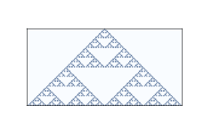

# 五、细胞自动机

元胞自动机（CA）是一个世界的模型，带有非常简单的物理。 “细胞”的意思是世界被分成一个大口袋，称为细胞。 “自动机”是一台执行计算的机器 - 它可能是一台真机。 ，但更多时候，“机器”是数学抽象或计算机的模拟。

本章介绍了史蒂文沃尔夫勒姆（Steven Wolfram）在 20 世纪 80 年代进行的实验，表明一些细胞自动机展示出令人惊讶的复杂行为，包括执行任意计算的能力。

我讨论了这些结果的含义，在本章的最后，我提出了在 Python 中高效实现 CA 的方法。

本章的代码位于本书仓库的`chap05.ipynb`中。 使用代码的更多信息，请参见第？章。

## 5.1 简单的 CA

元胞自动机 [1] 由规则来管理，它决定系统如何即时演化。 时间分为离散的步骤，规则规定了，如何根据当前状态计算下一个时间步骤中的世界状态。

作为一个微不足道的例子，考虑带有单个细胞的细胞自动机（CA）。 细胞状态是用变量`xi`表示的整数，其中下标`i`表示`xi`是时间步骤`i`期间的系统状态。 作为初始条件，`x0 = 0`。

现在我们需要一个规则。 我会任意选择`xi = x[i-1] + 1`，它表示在每个时间步骤之后，CA 的状态会增加 1。到目前为止，我们有一个简单的 CA ，执行简单的计算：它用于计数。

但是这个 CA 是不合规则的；可能的状态数通常是有限的。 为了使其成立，我将选择最小的感兴趣的状态数 2，和另一个简单的规则`xi = (x[i-1] + 1) % 2`，其中`%`是余数（或模）运算符。

这个 CA 的行为很简单：闪烁。 也就是说，在每个时间步之后，细胞的状态在 0 和 1 之间切换。

大多数 CA 是确定性的，这意味着规则没有任何随机元素；给定相同的初始状态，它们总是产生相同的结果。 也有不确定性的 CA，但我不会在这里涉及它们。

## 5.2 Wolfram 的实验

前一节中的 CA 只有一个细胞，所以我们可以将其视为零维，并且它不是很有趣。 在本章的其余部分中，我们将探索一维（1-D）CA，后者会变得非常有趣。

说 CA 有维度就是说细胞被安排在一个连续的空间中，这样它们中的一些可以看作“邻居”。 在一维中，有三种自然配置：

有限序列：

数量有限的细胞排成一排。 除第一个和最后一个之外的所有细胞都有两个邻居。

环：

数量有限的细胞排列成一个环。 所有细胞都有两个邻居。

无限序列：

数量无限的细胞排列成一排。

确定系统如何即时演化的规则，基于“邻域”的概念，即“邻域”，即决定给定细胞的下一个状态的一组细胞。

在二十世纪八十年代初，斯蒂芬沃尔夫勒姆发表了一系列论文，对一维 CA 进行了系统的研究。 他确定了四大类行为，每一类都比上一个更有趣。

Wolfram 的实验使用了三个细胞的邻域：细胞本身及其左右邻居。

在这些实验中，这些细胞有两个状态，分别表示为 0 和 1，所以规则可以通过一个表格进行汇总，它将邻域状态（状态的三元组）映射为中心细胞的下一个状态。 下表展示了一个示例：

| prev | 111 | 110 | 101 | 100 | 011 | 010 | 001 | 000 |
| --- | --- | --- | --- | --- | --- | --- | --- | --- |
| next | 0 | 0 | 1 | 1 | 0 | 0 | 1 | 0 |

第一行显示邻居可能拥有的八个状态。第二行显示下一个时间步骤中的中心细胞的状态。 作为该表的简明编码，Wolfram 建议将第二行读作二进制数。 因为二进制 00110010 是十进制的 50，所以 Wolfram 称这个 CA 为“规则 50”。

表 5.1：十个时间步骤之后的规则 50

上图展示了规则 50 在 10 个时间步骤之后的效果。 第一行展示第一个时间步骤内的系统状态; 它起始于一个“开”细胞，其余都是“关”。 第二行展示下一个时间步骤中的系统状态，以此类推。

图中的三角形是这些 CA 的典型；这是领域形状的结果吗？ 在一个时间步骤中，每个细胞都会影响任一方向上的邻居的状态。 在下一个时间步骤中，该影响可以在每个方向上向一个细胞传播。 因此，过去的每个细胞都有一个“影响三角形”，包括所有可能受其影响的细胞。

## 5.3 CA 的分类

图 5.2：64 个步骤之后的规则 18

