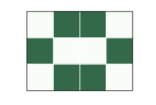

# 六、生命游戏

在本章中，我们考虑二维元胞自动机，特别是 John Conway 的生命游戏（GoL）。 像上一章中的一些 CA 一样，GoL 遵循简单的规则并产生令人惊讶的复杂行为。 就像沃尔夫勒姆的规则 110 一样，事实证明 GoL 是通用的；也就是说，至少在理论上它可以计算任何可计算的函数。

GoL 的复杂行为引发了科学哲学问题，特别是科学现实主义和工具主义的相关问题。 我讨论这些问题并提出扩展阅读的建议。

在本章的最后，我演示了如何在 Python 中高效实现 GoL。

本章的代码位于本书仓库的`chap06.ipynb`中。 使用代码的更多信息，请参见第？节。

## 6.1 Conway 的生命游戏

首先要研究的细胞自动机之一，也许是有史以来最受欢迎的一种，是称为“生命游戏”的二维 CA，简称 GoL。 它由 John H. Conway 开发并于 1970 年在《科学美国人》（Scientific American）的马丁加德纳（Martin Gardner）专栏中推广。 请参阅 <http://en.wikipedia.org/wiki/Conway_Game_of_Life>。

GoL 中的细胞排列在一个二维网格中，两个方向上都有限，或者首尾相接。 双向首尾相接的网格称为环面，因为它在地形上等同于多纳圈的表面。 见 <http://en.wikipedia.org/wiki/Torus>。

每个细胞有两个状态 - 生存和死亡 - 和八个邻居 - 东西南北和四个对角线。 这些邻居有时被称为“摩尔邻域”。

就像前面章节中的一维 CA 一样，生命游戏按照规则演变，这就像物理学的简单定律。

在 GoL 中，每个单元格的下一个状态取决于其当前状态和活动邻居的数量。 如果一个细胞是活的，如果它有两个或三个活动邻居就会生存，否则就会死亡。 如果一个细胞是死的，它将保持死亡，除非它恰好有三个邻居。

下表总结了这些规则：

| 当前状态 | 邻居数量 | 下一个状态 |
| --- | --- | --- |
| 生存 | 2–3 | 生存 |
| 生存 | 0–1, 4–8 | 死亡 |
| 死亡 | 3 | 生存 |
| 死亡 | 0–2, 4–8 | 死亡 |

这种行为与真正的细胞生长大致类似：分离或过度拥挤的细胞死亡；它们在中等密度下蓬勃成长。

GoL 很受欢迎，因为：

有简单的初始条件产生令人惊讶的复杂行为。

有许多有趣的稳定图案：有些摆动（以不同的周期），有些像 Wolfram 的 CA 规则 110 中的飞船一样移动。
和规则 110 一样，GoL 是图灵完整的。

另一个产生兴趣的因素是康威的猜测 - 没有可以使活细胞数量无限增长的初始条件 - 以及他向任何可以证明或否定它的人提供的 50 美元赏金。

最后，计算机日益增加的可用性，使得自动化计算并以图形方式显示结果成为可能。

## 6.2 生命图案

图 6.1：一个静态图案，叫做“蜂窝”

图 6.2：一个振荡图案，叫做“蟾蜍”

图 6.3：一个飞船，叫做“滑翔机”

