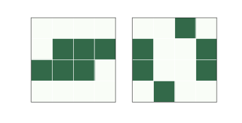
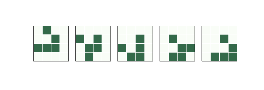
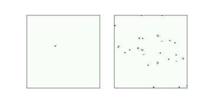
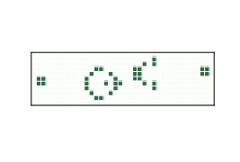

# 六、生命游戏

> 原文：[Chapter 6  Game of Life](http://greenteapress.com/complexity2/html/thinkcomplexity2007.html)

> 译者：[飞龙](https://github.com/wizardforcel)

> 协议：[CC BY-NC-SA 4.0](http://creativecommons.org/licenses/by-nc-sa/4.0/)

> 自豪地采用[谷歌翻译](https://translate.google.cn/)

在本章中，我们考虑二维细胞自动机，特别是 John Conway 的生命游戏（GoL）。 像上一章中的一些 CA 一样，GoL 遵循简单的规则并产生令人惊讶的复杂行为。 就像沃尔夫勒姆的规则 110 一样，事实证明 GoL 是通用的；也就是说，至少在理论上它可以计算任何可计算的函数。

GoL 的复杂行为引发了科学哲学问题，特别是科学现实主义和工具主义的相关问题。 我讨论这些问题并提出扩展阅读的建议。

在本章的最后，我演示了如何在 Python 中高效实现 GoL。

本章的代码位于本书仓库的`chap06.ipynb`中。 使用代码的更多信息，请参见第？节。

## 6.1 Conway 的生命游戏

首先要研究的细胞自动机之一，也许是有史以来最受欢迎的一种，是称为“生命游戏”的二维 CA，简称 GoL。 它由 John H. Conway 开发并于 1970 年在《科学美国人》（Scientific American）的马丁加德纳（Martin Gardner）专栏中推广。 请参阅 <http://en.wikipedia.org/wiki/Conway_Game_of_Life>。

GoL 中的细胞排列在一个二维网格中，两个方向上都有限，或者首尾相接。 双向首尾相接的网格称为环面，因为它在地形上等同于多纳圈的表面。 见 <http://en.wikipedia.org/wiki/Torus>。


每个细胞有两个状态 - 生存和死亡 - 和八个邻居 - 东西南北和四个对角线。 这些邻居有时被称为“摩尔邻域”。

就像前面章节中的一维 CA 一样，生命游戏按照规则演变，这就像物理学的简单定律。

在 GoL 中，每个单元格的下一个状态取决于其当前状态和活动邻居的数量。 如果一个细胞是活的，如果它有两个或三个活动邻居就会生存，否则就会死亡。 如果一个细胞是死的，它将保持死亡，除非它恰好有三个邻居。

下表总结了这些规则：

| 当前状态 | 邻居数量 | 下一个状态 |
| --- | --- | --- |
| 生存 | 2–3 | 生存 |
| 生存 | 0–1, 4–8 | 死亡 |
| 死亡 | 3 | 生存 |
| 死亡 | 0–2, 4–8 | 死亡 |

这种行为与真正的细胞生长大致类似：分离或过度拥挤的细胞死亡；它们在中等密度下蓬勃成长。

GoL 很受欢迎，因为：

有简单的初始条件产生令人惊讶的复杂行为。

有许多有趣的稳定图案：有些摆动（以不同的周期），有些像 Wolfram 的 CA 规则 110 中的飞船一样移动。
和规则 110 一样，GoL 是图灵完整的。

另一个产生兴趣的因素是康威的猜测 - 没有可以使活细胞数量无限增长的初始条件 - 以及他向任何可以证明或否定它的人提供的 50 美元赏金。

最后，计算机日益增加的可用性，使得自动化计算并以图形方式显示结果成为可能。

## 6.2 生命图案


图 6.1：一个静态图案，叫做“蜂巢”（beehive）



图 6.2：一个振荡图案，叫做“蟾蜍”（toad）



图 6.3：一个飞船，叫做“滑翔机”（glider）

如果从随机起始状态运行 GoL，可能会出现一些稳定图案。随着时间的推移，人们已经确定了这些图案并给了它们名字


例如，图？展示了一种称为“蜂巢”的稳定图案。蜂巢中的每个细胞都有两个或三个邻居，所以它们都能存活下来，蜂巢旁边的死细胞都没有三个邻居，所以没有新细胞诞生。

其他图案在“振荡”；也就是说，它们随着时间而改变，但最终返回到它们的起始状态（只要它们不与另一个图案冲突）。例如，图？展示了一种称为“蟾蜍”的图案，它是在两种状态之间交替的振荡图案。这个振荡图案的“周期”是二。


最后，一些图案振荡并返回到起始状态，但在空间中移动。因为这些图案似乎在移动，所以它们被称为“飞船”。

图？展示了一艘名为“滑翔机”的飞船。经过四段时间后，滑翔机回到起始位置，并向下和向右移动一个单位。


根据起始方向，滑翔机可以沿着四条对角线中的任何一条移动。还有其它的水平和垂直移动的飞船。

人们花费了大量时间来查找和命名这些图案。如果你搜索网页，你会发现很多收藏品。

## 6.3 Conwey 的推测

从最初的条件来看，GoL 迅速达到稳定状态，活细胞数量几乎不变（可能带有一些振荡）。



图 6.4：r-pentomino 的开始和最终状态

但是一些简单的开始条件，需要很长时间才能稳定下来，并产生令人惊讶的活细胞数量。 这些模式被称为“Methuselahs”，因为它们很长寿。


其中最简单的是 r-pentomino，它只有五个细胞，形状大致为字母“r”。 图？显示了 r-pentomino 的初始状态和 1103 步后的最终状态。

这种状态是“最终的”，因为所有剩余图案是稳定的，振荡的或滑翔机，它们永远不会与另一种图案相冲突。 r-pentomino 总共产生 6 个滑翔机，8 个积木（block），4 个闪光灯（blinker），4 个蜂巢，1 个小艇（boat），1 个轮船（ship）和 1 个面包（loaf）。



图 6.5：Gosper 的滑翔机枪，产生滑翔机流。

长寿图案的存在，使得康威怀疑是否存在从未稳定的初始图案。 他猜想没有，但他描述了两种证明他是错误的图案，“枪”（gun）和“蒸汽火车”（puffer train）。 枪是稳定的模式，定期产生飞船 - 随着飞船流从源位置移动，活细胞的数量无限增长。 蒸汽火车是一种将活细胞留在尾部的平移图案。


事实证明，这两种模式都存在。 由 Bill Gosper 领导的一个小组发现了第一个，它是现在称为 Gosper's Gun 的滑翔枪，如图所示。 Gosper 还发现了第一个蒸汽火车。

这两种类型都有很多图案，但它们很难设计或找到。 这不是巧合。 Conway 选择了 GoL 的规则，这样他的猜想就不会明显为真或假。 在二维 CA 的所有可能规则中，大多数产生简单的行为：大多数初始条件快速稳定或无限增长。 通过避免无趣的 CA，Conway 也避免了 Wolfram 的一类和二类行为，并且可能还有三类。

如果我们相信 Wolfram 的计算等价原则，我们预计 GoL 会属于第四类，而且是这样。 生命游戏在 1982 年被证明了图灵的完整性（1983年也是独立的）。 从那时起，几个人构建了 GoL 模式，实现了图灵机或另一台已知图灵完备的机器。

## 6.4 现实主义

GoL中的稳定模式很难不被注意，特别是那些移动的模式。 将它们视为持久的实体是很自然的事，但请记住，CA 是由细胞构成的；没有蟾蜍或面包这样的东西。 滑翔机和其他飞船甚至更不真实，因为随着时间的推移，它们甚至不由相同的细胞组成。 所以这些图案就像星座一样。 我们这样看待他们，因为我们善于观察图案，或者因为我们有活跃的想象力，但他们不是真实的。


对嘛？

好吧，不是那样。 我们认为“真实”的许多实体，也是规模较小的实体的持久图案。 飓风只是气流的模式，但我们给了他们个人名称。 而人就像滑翔机，随着时间的推移不是由相同细胞组成的。 但即使你更换了你体内的每一个细胞，我们也认为你是同一个人。

这不是一个新观察 - 大约在 2500 年前，赫拉克利特（Heraclitus）指出你不能在同一条河流中两次 - 但是出现在生命游戏中的实体，是思考哲学现实主义的实用测试用例。


在哲学的背景下，现实主义是这样一种观点，即世界中的实体存在与人类的感知和概念无关。 “感知”是指我们从感官中获得的信息，而“概念”是指我们形成的世界的心智模式。 例如，我们的视觉系统将一些东西感知为场景的二维投影，我们的大脑使用该图像构建场景中物体的三维模型。

科学实在论与科学理论和他们所假设的实体有关。 如果一个理论使用实体的属性和行为来表达，那么这个理论假设了一个实体。 例如，电磁学的理论用电场和磁场表示。 经济学的一些理论以供给，需求和市场力量来表达。 生物学的理论是用基因来表达的。

但这些实体是真实的吗？ 也就是说，它们存在于独立于我们和我们的理论的世界吗？


再次，我发现，在一系列强度中陈述哲学立场是有用的；这里有四个科学现实主义的陈述，强度逐渐增加：

SR1：

对于它们接近现实的程度，科学理论为真或假，但没有理论是完全正确的。 一些所假设的实体可能是真实的，但没有原则性的方式来说出哪些是真实的。

SR2：

随着科学的进步，我们的理论会变得更加逼近现实。 至少有一些所假定的实体是已知真实的。

SR3：

有些理论是完全正确的；其他近似真实。 真实理论所假设的实体，以及近似真实理论中的一些实体是真实的。

SR4：

如果一个理论正确地描述了现实，那么这个理论就是真的，否则就是假。真实理论所假设的实体是真实的；其他不是。

SR4 非常强，可能是站不住脚的；通过这样一个严格的标准，几乎所有当前的理论都被认为是错误的。 大多数现实主义者会接受 SR1 和 SR3 之间的东西。

## 6.5 工具主义

但 SR1 很弱以至于它接近工具主义，这是一种观点，我们不能说理论是真是假，因为我们不知道理论是否符合现实。 理论是我们用于我们的目的的工具；在适用于其目的的程度上，理论是有用的，或者不是。


要看看你是否对工具主义感到满意，请考虑以下陈述：

“声明游戏中的实体并不是真实的；他们只是人们赋予可爱的名字的细胞图案。”

“飓风只是一种气流模式，但它是一种有用的描述，因为它可以让我们进行有关天气的预测和沟通。”

“像自我和超我这样的弗洛伊德实体并不是真实的，但它们是思考和交流心理学的有用工具（或者至少有些人是这么认为的）。”

“电磁场是我们最好的电磁理论中的假设实体，但它们并不真实。 我们可以构建其他理论，而不用场的假设，这也是一样有用的。”

“我们认为，世界上的许多物体都是像星座一样的任意集合。 例如，蘑菇只是真菌的子实体，其中大部分是在地下生长的，几乎不连续的细胞网络。 我们由于实际原因专注于蘑菇，如可见性和可爱。”

“有些物体边界清晰，但很多都是模糊的。 例如，哪些分子是你身体的一部分：你的肺里的空气？ 你的胃里的食物？ 你血液中的营养物质？ 细胞中的营养物质？ 细胞中的水？ 细胞的结构部分？ 头发？ 死皮？ 污垢？ 你的皮肤上的细菌？ 你的肠道细菌？线粒体？ 当你称量自己时，你包含了多少这些分子？ 根据离散对象构想世界是有用的，但我们确定的实体并不是真实的。”

对于每一个你同意的陈述，给自己一分。 如果你的分数超过 4 分，你可能会成为一名工具主义者！

如果你比其他人更喜欢这些陈述，那么问问你自己为什么。 这些情景中的哪些差异会影响你的反应？ 你能否在他们之间做出原则性区分？

工具主义的更多信息，请参阅 <http://en.wikipedia.org/wiki/Instrumentalism>。

## 6.6 实现

本章最后的练习要求你尝试和修改生命游戏，并实现其他二维细胞自动机。 本节介绍 GoL 的实现，你可以将其用作实验的起始位置。

为了表示细胞的状态，我使用类型为`uint8`的 NumPy 数组，它是一个 8 位无符号整数。 例如，下面这行创建一个 10 乘 10 的数组，并用 0 和 1 的随机值进行初始化。

```py
a = np.random.randint(2, size=(10, 10)).astype(np.uint8)
```

我们可以用几种方法计算 GoL 规则。 最简单的方法是使用`for`循环遍历数组的行和列：

```py

b = np.zeros_like(a)
rows, cols = a.shape
for i in range(1, rows-1):
    for j in range(1, cols-1):
        state = a[i, j]
        neighbors = a[i-1:i+2, j-1:j+2]
        k = np.sum(neighbors) - state
        if state:
            if k==2 or k==3:
                b[i, j] = 1
        else:
            if k == 3:
                b[i, j] = 1
```

最初，`b`是一个与`a`大小相同的零数组。 每次循环中，状态是中心细胞的条件，邻居是`3×3`的邻域。 `k`是活动邻居的数量（不包括中心细胞）。 嵌套的`if`语句评估 GoL 规则并相应地激活`b`中的细胞。

这个实现是规则的直接翻译，但它是冗长而缓慢的。 我们可以使用互相关做得更好，正如我们在第？节中看到的那样。 在那里，我们使用`np.correlate`来计算一维相关。 现在，为了计算二维相关，我们将使用`scipy.signal`中的`correlate2d`，它是一个 SciPy 模块，提供信号处理的相关函数：

```py

from scipy.signal import correlate2d

kernel = np.array([[1, 1, 1],
                   [1, 0, 1],
                   [1, 1, 1]])

c = correlate2d(a, kernel, mode='same')
```

在一维相关的背景下，我们称之为“窗口”的内容，在二维相关的背景下被称为“核”，但其想法是相同的：`correlate2d`将核和数组相乘来选择一个邻域，然后将结果加起来。 这会核选择中心细胞周围的 8 个邻居。

`correlate2d`将核应用于数组中的每个位置。 使用`mode ='same'`时，结果与`a`的大小相同。

现在我们可以使用逻辑运算符来计算规则：

```py

b = (c==3) | (c==2) & a
b = b.astype(np.uint8)
```

第一行计算了一个布尔数组，其中应该有活细胞的地方为`True`，其他地方为`False`。 然后，`astype`将布尔数组转换为整数数组。

这个版本更快，也许够好，但是我们可以通过修改核来简化它：

```py
kernel = np.array([[1, 1, 1],
                   [1,10, 1],
                   [1, 1, 1]])

c = correlate2d(a, kernel, mode='same')
b = (c==3) | (c==12) | (c==13)
b = b.astype(np.uint8)
```

这个版本核的包含中心单元并赋予其权重 10。如果中心单元为 0，则结果介于 0 和 8 之间; 如果中心单元为 1，则结果在 10 到 18 之间。使用这个核，我们可以简化逻辑运算，只选择值为 3，12 和 13 的细胞。

这看起来可能不是什么大的改进，但它允许进一步简化：使用这个核，我们可以使用一个表来查找细胞的值，就像我们在第？节中所做的那样。

```py

table = np.zeros(20, dtype=np.uint8)
table[[3, 12, 13]] = 1
c = correlate2d(a, kernel, mode='same')
b = table[c]
```

除了位置 3，12 和 13 以外，表格中的任何位置都为零。当我们使用`c`作为表格中的索引时，NumPy 执行逐元素查找；也就是说，它从`c`中获取每个值，在表中查找它并将结果放入`b`中。

这个版本比其他版本更快更简洁， 唯一的缺点是需要更多的解释。

包含在本书仓库中的`Life.py`提供了一个封装规则实现的`Life`类。 如果你执行`Life.py`，你应该看到一个“蒸汽火车”的动画，这是一种飞船，在其尾部留下一串碎屑。

## 6.7 练习

练习 1

本章的代码位于本书仓库的 Jupyter 笔记本`chap06.ipynb`中。 打开这个笔记本，阅读代码，然后运行单元格。 你可以使用这个笔记本来练习本章的练习。 我的解决方案在`chap06soln.ipynb`中。

练习 2

以随机状态启动 GoL 并运行它直至稳定。 你可以识别哪些稳定的图案？

练习 3

许多命名图案都以便携式文件格式提供。 修改`Life.py`来解析其中一种格式并初始化网格。

练习 4

一种最长寿的小型图案是“兔子”，它以 9 个活动细胞开始，需要 17 331 个步骤来稳定。 你可以在 <http://www.conwaylife.com/wiki/Rabbits> 获取各种格式的初始状态。 加载此状态并运行它。

练习 5

在我的实现中，`Life`类基于一个名为`Cell2D`的父类，`LifeViewer`基于`Cell2DViewer`。 你可以使用这些基类来实现其他二维细胞自动机。

例如，GoL 的一个变体叫做“Highlife”，与 GoL 规则相同，另外还有一条规则：有 6 个邻居的死亡细胞会变活。

编写一个名为`Highlife`的类，该类继承自`Cell2D`并实现这个版本的规则。 另外编写一个名为`HighlifeViewer`的类，该类继承自`Cell2DViewer`并尝试以不同的方式来展示结果。 作为一个简单的例子，使用不同的颜色表。

`Highlife`中更有趣的图案之一是复制器（replicator）。 使用`add_cells`和复制器初始化`Highlife`并查看它做了什么。

练习 6

如果将图灵机扩展到两个维度，或者将读写头添加到二维 CA，则结果是称为 Turmite 的细胞自动机。由于读写头移动的方式，它以白蚁（termite）命名，但拼写错误是对 Alan Turing 的敬意。


最着名的 Turmite 是 1986 年由 Chris Langton 发现的兰顿的蚂蚁（Langton's Ant）。请见 <http://en.wikipedia.org/wiki/Langton_ant>。


蚂蚁（ant）是一个具有四种状态的读写头，你可以将其视为面向东、西、南或北。细胞有两种状态，黑色和白色。


规则很简单。在每个时间步骤中，蚂蚁检查它所在单元格的颜色。如果是黑色，蚂蚁转向右转，将细胞变成白色，并向前移动一个格子。如果细胞是白色的，蚂蚁会向左转，将细胞变成黑色，然后向前移动。


给定一个简单的世界，一组简单的规则，并且只有一个可移动的部分，你可能会期望看到简单的行为 - 但你现在应该更清楚。从所有的白色细胞开始，在进入周期为 104 步的循环之前，兰顿的蚂蚁以看似随机的方式移动超过 10000 步。每个循环后，蚂蚁都会沿对角线平移，因此会留下一条称为“高速路”的踪迹。


编写兰顿的蚂蚁的实现。
