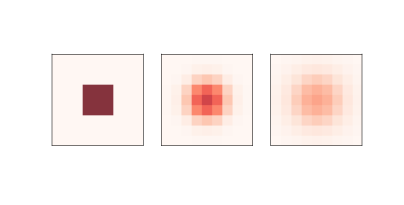
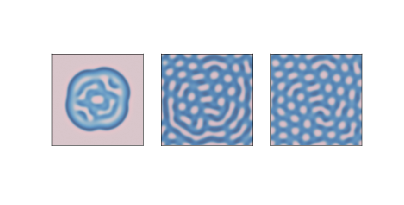
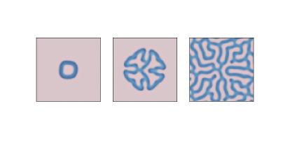

# 七、物理建模

到目前为止，我们所看到的细胞自动机不是物理模型；也就是说，他们不打算描述现实世界中的系统。 但是一些 CA 用作物理模型。

在本章中，我们考虑一个 CA，它模拟扩散（散开）并相互反应的化学物质，这是 Alan Turing 提出的过程，用于解释一些动物模式如何发展。

我们将试验一种 CA，它模拟通过多孔材料的渗透液体，例如通过咖啡渣的水。 这个模型是展示相变行为和分形几何的几个模型中的第一个，我将解释这两者的含义。

本章的代码位于本书仓库的`chap07.ipynb`中。 使用代码的更多信息，请参见第？节。

## 7.1 扩散

1952 年，艾伦图灵发表了一篇名为“形态发生的化学基础”的论文，该论文描述了涉及两种化学物质的系统行为，它们在空间中扩散并相互反应。 他表明，这些系统根据扩散和反应速率产生了广泛的模式，并推测像这样的系统可能是生物生长过程中的重要机制，特别是动物着色模式的发展。

图灵模型基于微分方程，但也可以使用元胞自动机来实现。

但在我们开始使用图灵模型之前，我们先从简单的事情开始：只有一种化学物质的扩散系统。 我们将使用 2-D CA，其中每个细胞的状态是连续的数量（通常在 0 和 1 之间），表示化学物质的浓度。

我们将通过比较每个细胞与其邻居的均值，来建模扩散过程。 如果中心细胞的浓度超过领域均值，则化学物质从中心流向邻居。 如果中心细胞的浓度较低，则化学物质以另一种方式流动。

以下核计算每个细胞与其邻居均值之间的差异：

```py

kernel = np.array([[0, 1, 0],
                   [1,-4, 1],
                   [0, 1, 0]])
```

使用`np.correlate2d`，我们可以将这个核应用于数组中的每个细胞：

```py

c = correlate2d(array, kernel, mode='same')
```

我们将使用一个扩散常数`r`，它关联了浓度差与流速：

```py
array += r * c
```



图 7.1：0，5 和 10 步后的简单扩散模型

图？显示 CA 的结果，其中`n=9, r=0.1`，除了中间的“岛”外，初始浓度为 0。 该图显示了 CA 的启动状态，以及 5 步和 10 步之后的状态。 化学物质从中心向外扩散，直到各处浓度相同。

## 7.2 反应扩散

现在我们添加第二种化学物。 我将定义一个新对象`ReactionDiffusion`，它包含两个数组，每个化学物对应一个：

```py

class ReactionDiffusion(Cell2D):

   def __init__(self, n, m, params):
        self.params = params
        self.array = np.ones((n, m), dtype=float)
        self.array2 = np.zeros((n, m), dtype=float)
        island(self.array2, val=0.1, noise=0.1)
```

`n`和`m`是数组中的行数和列数。 `params`是参数元组，下面我会解释它。

数组代表第一种化学物质`A`的浓度，它最初是无处不在的。

`array2`表示`B`的浓度，除了中间的一个岛屿，它初始为零，并且由`island`初始化：

```py

def island(a, val, noise):
    n, m = a.shape
    r = min(n, m) // 20
    a[n//2-r:n//2+r, m//2-r:m//2+r] = val
    a += noise * np.random.random((n, m))
```

岛的半径`r`是`n`或`m`的二十分之一，以较小者为准。 岛的高度是`val`，在这个例子中是`0.1`。 此外，随机均匀噪声（值为 0 到`noise`）添加到整个数组。

这里是更新数组的`step `函数：

```py
def step(self):
    """Executes one time step."""
    A = self.array
    B = self.array2
    ra, rb, f, k = self.params

    cA = correlate2d(A, self.kernel, **self.options)
    cB = correlate2d(B, self.kernel, **self.options)

    reaction = A * B**2
    self.array += ra * cA - reaction + f * (1-A)
    self.array2 += rb * cB + reaction - (f+k) * B
```

参数是

`ra`：

`A`的扩散速率（类似于前一节中的`r`）。

`rb`：

`B`的扩散速率。在该模型的大多数版本中，`rb`约为`ra`的一半。

`f`：

进给速率，控制着`A`添加到系统的速度。

`k`：

移除速率，控制`B`从系统中移除的速度。

现在让我们仔细看看更新语句：

```py

reaction = A * B**2
self.array += ra * cA - reaction + f * (1-A)
self.array2 += rb * cB + reaction - (f+k) * B
```

数组`cA`和`cB`是将扩散核应用于`A`和`B`的结果。乘以`ra`和`rb`得出进入或离开每个细胞的扩散速率。

表达式`A * B ** 2`表示`A`和`B`相互反应的比率。 假设反应消耗`A`并产生`B`，我们在第一个方程中减去这个项并在第二个方程中加上它。

表达式`f * (1-A)`决定`A`加入系统的速率。 当`A`接近 0 时，最大进给速率为`f`。 当`A`接近 1 时，进给速率下降到零。

最后，表达式`(f+k) * B`决定`B`从系统中移除的速率。 当`B`接近 0 时，该比率变为零。

只要速率参数不太高，`A`和`B`的值通常保持在 0 和 1 之间。



图 7.2：1000，2000 和 4000 步之后的反应扩散模型，参数为`f=0.035`和`k=0.057`

使用不同的参数，该模型可以产生类似于各种动物身上的条纹和斑点的图案。 在某些情况下，相似性是惊人的，特别是当进给和移除参数在空间上变化时。

对于本节中的所有模拟，`ra = 0.5`，`rb = 0.25`。

图？显示了`f=0.035`和`k=0.057`的结果，`B`的浓度以较暗的颜色显示。 有了这些参数，系统就向稳定状态演化，在`B`的黑色背景上有`A`的光点。



图 7.3：1000，2000 和 4000 步之后的反应扩散模型，参数为`f=0.055`和`k=0.062`

图？显示了`f = 0.055`和`k = 0.062`的结果，在`A`的背景上产生了珊瑚样的`B`。


图 7.4：1000，2000 和 4000 步之后的反应扩散模型，参数为`f=0.039`和`k=0.065`

图？显示了`f = 0.039`和`k = 0.065`的结果。 在类似于有丝分裂的过程中，这些参数产生的`B`点生长和分裂，最后形成稳定的等距点图案。

1952 年以来，观察和实验为图灵猜想提供了一些支持。 目前为止，看起来许多动物图案实际上由某种反应扩散过程形成，但尚未证实。
