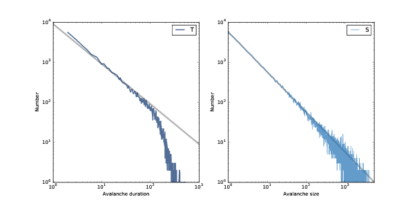
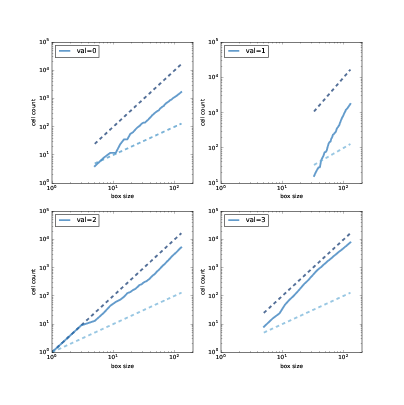

# 八、自组织临界

在前一章中，我们看到了一个具有临界点的系统的例子，并且我们探索了临界系统 - 分形几何的一个共同特性。

在本章中，我们将探讨临界系统的另外两个性质：重尾分布，我们在第五章中见过，和粉红噪声，我将在本章中解释。

这些性质是部分有趣的，因为它们在自然界中经常出现；也就是说，许多自然系统会产生分形几何，重尾分布和粉红噪声。

这个观察提出了一个自然的问题：为什么许多自然系统具有临界系统的特性？一个可能的答案是自组织临界性（SOC），这是一些系统向临界状态演化并保持它的趋势。

在本章中，我将介绍沙堆模型，这是第一个展示 SOC 的系统。

本章的代码位于本书仓库的`chap08.ipynb`中。使用代码的更多信息，请参见第？章。

## 8.1 临界系统

许多关键系统表现出常见的行为：

+   分形几何：例如，冷冻的水倾向于形成分形图案，包括雪花和其他晶体结构。分形的特点是自相似性；也就是说，图案的一部分与整体的缩放副本相似。

+   一些物理量的重尾分布：例如，在冷冻的水中，晶体尺寸的分布是幂律的。

+   呈现粉红噪音的时间变化。复合信号可以分解为它们的频率分量。在粉红噪声中，低频分量比高频分量功率更大。具体而言，频率`f`处的功率与`1 / f`成正比。

临界系统通常不稳定。例如，为了使水保持部分冷冻状态，需要主动控制温度。如果系统接近临界温度，则小型偏差倾向于将系统从一个相位移到另一个相位。

许多自然系统表现出典型的临界性行为，但如果临界点不稳定，它们本质上不应该是常见的。这是 Bak，Tang 和 Wiesenfeld 的解决的困惑。他们的解决方案称为自组织临界（SOC），其中“自组织”意味着从任何初始状态开始，系统都会转向临界状态，并停留在那里，无需外部控制。

## 8.2 沙堆

沙堆模型由 Bak，Tang 和 Wiesenfeld 于 1987 年提出。它不是一个现实的沙堆模型，而是一个抽象，它用（1）大量（2）与邻居互动的元素来模拟物理系统。


沙堆模型是一个二维元胞自动机，每个细胞的状态代表沙堆的部分斜率。在每个时间步骤中，检查每个细胞来查看它是否超过临界值`K`，通常是 3。如果是，则它会“倒塌”并将沙子转移到四个相邻细胞；也就是说，细胞的斜率减少 4，并且每个邻居增加 1。在网格的周边，所有细胞保持为斜率 0，所以多余的会溢出边缘。


Bak，Tang 和 Wiesenfeld 首先将所有细胞初始化为大于`K`的水平，然后运行模型直至稳定。然后他们观察微小扰动的影响；他们随机选择一个细胞，将其值增加 1，然后再次运行模型，直至稳定。

对于每个扰动，他们测量`T`，这是沙堆稳定所需的时间步数，`S`是倒塌的细胞总数。

大多数情况下，放置一粒沙子不会导致细胞倒塌，因此`T = 1`和`S = 0`。 但偶尔一粒沙子会引起雪崩，影响很大一部分网格。 结果表明，`T`和`S`的分布是重尾的，这支持了系统处于临界状态的断言。


他们得出结论：沙堆模型表现出“自组织临界性”，这意味着从最初的状态开始，它不需要外部控制，或者称之为“微调”任何参数，就可以向临界状态发展。 随着更多沙粒的添加，模型仍处于临界状态。

在接下来的几节中，我复制他们的实验并解释结果。

## 8.3 实现沙堆

为了实现沙堆模型，我定义了一个名为`SandPile`的类，该类继承自`Cell2D.py`中定义的`Cell2D`。

```py

class SandPile(Cell2D):

    def __init__(self, n, m, level=9):
        self.array = np.ones((n, m)) * level
```

数组中的所有值都初始化为`level`，这通常大于倒塌阈值`K`。

以下是`step `方法，它找到大于`K`的所有细胞并将它们推翻：

```py
kernel = np.array([[0, 1, 0],
                       [1,-4, 1],
                       [0, 1, 0]], dtype=np.int32)

def step(self, K=3):
    toppling = self.array > K
    num_toppled = np.sum(toppling)
    c = correlate2d(toppling, self.kernel, mode='same')
    self.array += c
    return num_toppled
```

为了解释这是如何工作的，我将从一小堆开始，只有两个准备推翻的细胞：

```py

pile = SandPile(n=3, m=5, level=0)
pile.array[1, 1] = 4
pile.array[1, 3] = 4
```

最初，`pile.array`是这样：

```py

[[0 0 0 0 0]
 [0 4 0 4 0]
 [0 0 0 0 0]]
```

现在我们可以选择高于倒塌阈值的细胞：

```py

toppling = pile.array > K
```

结果是一个布尔数组，但是我们可以像整数数组一样使用它：

```py

[[0 0 0 0 0]
 [0 1 0 1 0]
 [0 0 0 0 0]]
```

如果我们关联这个数组和核起来，它会在每个`toppling`是 1 的地方复制这个核。

```py

c = correlate2d(toppling, kernel, mode='same')
```

这就是结果：

```py

[[ 0  1  0  1  0]
 [ 1 -4  2 -4  1]
 [ 0  1  0  1  0]]
```

注意，在核的副本重叠的地方，它们会相加。

这个数组包含每个细胞的改变量，我们用它来更新原始数组：

```py

pile.array += c
```

这就是结果：

```py

[[0 1 0 1 0]
 [1 0 2 0 1]
 [0 1 0 1 0]]
```

这就是`step`的工作原理。

默认情况下，`correlate2d`认为数组的边界固定为零，所以任何超出边界的沙粒都会消失。

`SandPile`还提供了`run`，它会调用`step`，直到没有更多的细胞倒塌：

```py

def run(self):
    total = 0
    for i in itertools.count(1):
        num_toppled = self.step()
        total += num_toppled
        if num_toppled == 0:
            return i, total
```

返回值是一个元组，其中包含时间步数和倒塌的细胞总数。

如果你不熟悉`itertools.count`，它是一个无限生成器，它从给定的初始值开始计数，所以`for`循环运行，直到`step`返回 0。

最后，`drop`方法随机选择一个细胞并添加一粒沙子：

```py

def drop(self):
    a = self.array
    n, m = a.shape
    index = np.random.randint(n), np.random.randint(m)
    a[index] += 1
```

让我们看一个更大的例子，其中` n=20`：

```py

pile = SandPile(n=20, level=10)
pile.run()
```


图 8.1：沙堆模型的初始状态（左），和经过 200 步（中）和 400 步（右）之后的状态

初始级别为 10 时，这个沙堆需要 332 个时间步才能达到平衡，共有 53,336 次倒塌。 图？（左）展示了初始运行后的状态。 注意它具有重复元素，这是分形特征。 我们会很快回来的。

图？（中）展示了在将 200 粒沙子随机放入细胞之后的沙堆构造，每次都运行直至达到平衡。 初始状态的对称性已被打破；状态看起来是随机的。

最后图？（右）展示了 400 次放置后的状态。 它看起来类似于 200 次之后的状态。 事实上，这个沙堆现在处于稳定状态，其统计属性不会随着时间而改变。 我将在下一节中解释一些统计属性。

## 8.4 重尾分布

如果沙堆模型处于临界状态，我们希望为一些数量找到重尾分布，例如雪崩的持续时间和大小。 所以让我们来看看。

我会生成一个更大的沙堆，`n = 50`，初始水平为 30，然后运行直到平衡状态：

```py

pile2 = SandPile(n=50, level=30)
pile2.run()
```

下面我们会运行 100,000 个随机放置。

```py

iters = 100000
res = [pile2.drop_and_run() for _ in range(iters)]
```

顾名思义，`drop_and_run`调用`drop`和`run`，并返回雪崩的持续时间和倒塌的细胞总数。

所以`res`是`(T, S)`元组的列表，其中`T`是持续时间，以时间步长为单位，并且`S`是倒塌的细胞。 我们可以使用`np.transpose`将`res`解构为两个 NumPy 数组：

```py

T, S = np.transpose(res)
```

大部分放置的持续时间为 1，没有倒塌的细胞，所以我们会将这些过滤掉。

```py
T = T[T>1]
S = S[S>0]
```

`T`和`S`的分布有许多小值和一些非常大的值。 我将使用`thinkstats2`中的`Hist`类创建值的直方图; 即每个值到其出现次数的映射。

```py

from thinkstats2 import Hist

histT = Hist(T)
histS = Hist(S)
```


图 8.2：雪崩持续时间（左）和大小（右）的分布，线性刻度。



图 8.3：雪崩持续时间（左）和大小（右）的分布，双对数刻度。

图？显示了值小于 50 的结果。但正如我们在第？节中看到的那样，我们可以通过将它们绘制在双对数坐标上，更清楚地了解这些分布，如图？所示。

对于 1 到 100 之间的值，分布在双对数刻度上几乎是直的，这表示了重尾。 图中的灰线斜率为 -1，这表明这些分布遵循参数为`α=1`的幂律。

对于大于 100 的值，分布比幂律模型下降更快，这意味着较大值比模型的预测更少。 一种解释是，这种效应是由于沙堆的有限尺寸造成的，因此我们可能预计，更大的沙堆能更好地拟合幂律。

另一种可能性是，这些分布并不严格遵守幂律，你可以在本章结尾的一个练习中探索。 但即使它们不是幂律分布，它们仍然是重尾的，因为我们预计系统处于临界状态。

## 8.5 分形

临界系统的另一个属性是分形几何。 图中的初始状态 （左）类似于分形，但是你不能总是通过观察来分辨。 识别分形的更可靠的方法是估计其分形维度，正如第？节那样。

我首先制作一个更大的沙堆，`n = 131`，初始水平为 22。

```py

pile3 = SandPile(n=131, level=22)
pile3.run()
```

顺便说一下，这个沙堆达到平衡需要 28,379 步，超过 2 亿个细胞倒塌。

为了更清楚地看到生成的团，我选择水平为 0, 1, 2 和 3 的细胞，并分别绘制它们：

```py

def draw_four(viewer, vals=range(4)):
    thinkplot.preplot(rows=2, cols=2)
    a = viewer.viewee.array

    for i, val in enumerate(vals):
        thinkplot.subplot(i+1)
        viewer.draw_array(a==vals[i], vmax=1)
```

`draw_four`需要`SandPileViewer`对象，它在`Sand.py`中定义。 参数`vals`是我们想要绘制的值的列表; 默认值是 0, 1, 2 和 3。

以下是它的使用方式：

```py

viewer3 = SandPileViewer(pile3)
draw_four(viewer3)
```


图 8.4：沙堆模型的初始状态，从上到下，从左到右选择水平为 0, 1, 2 和 3 的细胞。

图？展示了结果。 现在对于这些图案中的每一个，我们都可以使用方框计数算法来估计分形维数：我们将计算沙堆中心的小方框中的细胞数量，然后看看细胞数量随着方框变大而如何增加。 这是我的实现：

```py
def count_cells(a):
    n, m = a.shape
    end = min(n, m)

    res = []
    for i in range(1, end, 2):
        top = (n-i) // 2
        left = (m-i) // 2
        box = a[top:top+i, left:left+i]
        total = np.sum(box)
        res.append((i, i**2, total))

    return np.transpose(res)
```

参数`a`是 NumPy 布尔数组，值为 0 和 1。 方框的大小最初为 1，每次循环中，它会增加 2，直到到达终点，它是`n`和`m`中较小的一个。

每次循环中，`box`都是一组宽度和高度为`i`的细胞，位于数组中心。 `total`是方框中“开”细胞的数量。

结果是一个元组列表，其中每个元组包含`i`和`i ** 2`，用于比较，以及方框中的细胞数量。

最后，我们使用`np.transpose`生成一个 NumPy 数组，其中包含`i`，`i ** 2`和`total`。

为了估计分形维度，我们提取行：

```py
steps, steps2, cells = res
```

之后绘制结果：

```py

thinkplot.plot(steps, steps2, linestyle='dashed')
thinkplot.plot(steps, cells)
thinkplot.plot(steps, steps, linestyle='dashed')
```

然后使用`linregress `在双对数刻度上拟合直线：

```py

from scipy.stats import linregress

params = linregress(np.log(steps), np.log(cells))
slope = params[0]
```



图 8.5：与斜率位 1 和 2 的虚线相比，水平为 0, 1, 2 和 3 的细胞的方框计数。

图？展示了结果。 请注意，只有`val = 2`（左下）从方框大小 1 开始，因为中心细胞的值为 2；其他直线从包含非零细胞数的第一个方框大小开始。

在双对数刻度上，细胞计数几乎形成直线，这表明我们正在测量方框大小的有效范围内的分形维度。

估计的分形维度是：

```py

0  1.871
1  3.502
2  1.781
3  2.084
```

值为 0, 1 和 2 的分形维度似乎明显不是整数，这表明图像是分形的。

严格来说，值为 3 的分形维度与 2 不可区分，但考虑到其他值的结果，线的表观曲率和图案的外观，似乎它也是分形的。

本章结尾的练习之一，要求您使用不同的`n`和`level`值，再次运行此分析，来查看估计的维度是否一致。
