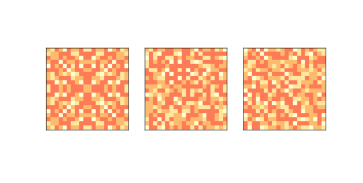
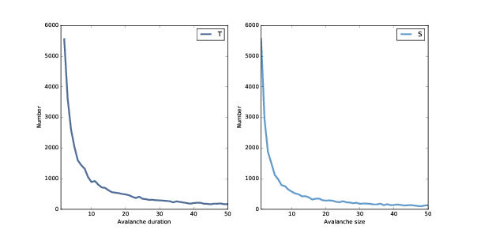
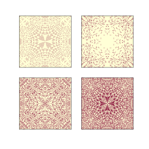
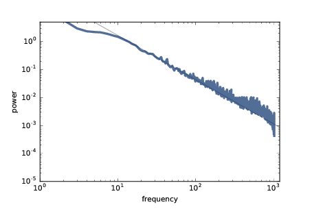

# 八、自组织临界

> 原文：[Chapter 8  Self-organized criticality](http://greenteapress.com/complexity2/html/thinkcomplexity2009.html)

> 译者：[飞龙](https://github.com/wizardforcel)

> 协议：[CC BY-NC-SA 4.0](http://creativecommons.org/licenses/by-nc-sa/4.0/)

> 自豪地采用[谷歌翻译](https://translate.google.cn/)

在前一章中，我们看到了一个具有临界点的系统的例子，并且我们探索了临界系统 - 分形几何的一个共同特性。

在本章中，我们将探讨临界系统的另外两个性质：重尾分布，我们在第五章中见过，和粉红噪声，我将在本章中解释。

这些性质是部分有趣的，因为它们在自然界中经常出现；也就是说，许多自然系统会产生分形几何，重尾分布和粉红噪声。

这个观察提出了一个自然的问题：为什么许多自然系统具有临界系统的特性？一个可能的答案是自组织临界性（SOC），这是一些系统向临界状态演化并保持它的趋势。

在本章中，我将介绍沙堆模型，这是第一个展示 SOC 的系统。

本章的代码位于本书仓库的`chap08.ipynb`中。使用代码的更多信息，请参见第？章。

## 8.1 临界系统

许多关键系统表现出常见的行为：

+   分形几何：例如，冷冻的水倾向于形成分形图案，包括雪花和其他晶体结构。分形的特点是自相似性；也就是说，图案的一部分与整体的缩放副本相似。

+   一些物理量的重尾分布：例如，在冷冻的水中，晶体尺寸的分布是幂律的。

+   呈现粉红噪声的时间变化。复合信号可以分解为它们的频率分量。在粉红噪声中，低频分量比高频分量功率更大。具体而言，频率`f`处的功率与`1 / f`成正比。

临界系统通常不稳定。例如，为了使水保持部分冷冻状态，需要主动控制温度。如果系统接近临界温度，则小型偏差倾向于将系统从一个相位移到另一个相位。

许多自然系统表现出典型的临界性行为，但如果临界点不稳定，它们本质上不应该是常见的。这是 Bak，Tang 和 Wiesenfeld 的解决的困惑。他们的解决方案称为自组织临界（SOC），其中“自组织”意味着从任何初始状态开始，系统都会转向临界状态，并停留在那里，无需外部控制。

## 8.2 沙堆

沙堆模型由 Bak，Tang 和 Wiesenfeld 于 1987 年提出。它不是一个现实的沙堆模型，而是一个抽象，它用（1）大量（2）与邻居互动的元素来模拟物理系统。


沙堆模型是一个二维细胞自动机，每个细胞的状态代表沙堆的部分斜率。在每个时间步骤中，检查每个细胞来查看它是否超过临界值`K`，通常是 3。如果是，则它会“倒塌”并将沙子转移到四个相邻细胞；也就是说，细胞的斜率减少 4，并且每个邻居增加 1。在网格的周边，所有细胞保持为斜率 0，所以多余的会溢出边缘。


Bak，Tang 和 Wiesenfeld 首先将所有细胞初始化为大于`K`的水平，然后运行模型直至稳定。然后他们观察微小扰动的影响；他们随机选择一个细胞，将其值增加 1，然后再次运行模型，直至稳定。

对于每个扰动，他们测量`T`，这是沙堆稳定所需的时间步数，`S`是倒塌的细胞总数 [1]。

> [1] 原始论文使用了`S`的不同定义，但是后来的工作使用了这个定义。

大多数情况下，放置一粒沙子不会导致细胞倒塌，因此`T = 1`和`S = 0`。 但偶尔一粒沙子会引起雪崩，影响很大一部分网格。 结果表明，`T`和`S`的分布是重尾的，这支持了系统处于临界状态的断言。


他们得出结论：沙堆模型表现出“自组织临界性”，这意味着从最初的状态开始，它不需要外部控制，或者称之为“微调”任何参数，就可以向临界状态发展。 随着更多沙粒的添加，模型仍处于临界状态。

在接下来的几节中，我复制他们的实验并解释结果。

## 8.3 实现沙堆

为了实现沙堆模型，我定义了一个名为`SandPile`的类，该类继承自`Cell2D.py`中定义的`Cell2D`。

```py

class SandPile(Cell2D):

    def __init__(self, n, m, level=9):
        self.array = np.ones((n, m)) * level
```

数组中的所有值都初始化为`level`，这通常大于倒塌阈值`K`。

以下是`step `方法，它找到大于`K`的所有细胞并将它们推翻：

```py
kernel = np.array([[0, 1, 0],
                       [1,-4, 1],
                       [0, 1, 0]], dtype=np.int32)

def step(self, K=3):
    toppling = self.array > K
    num_toppled = np.sum(toppling)
    c = correlate2d(toppling, self.kernel, mode='same')
    self.array += c
    return num_toppled
```

为了解释这是如何工作的，我将从一小堆开始，只有两个准备推翻的细胞：

```py

pile = SandPile(n=3, m=5, level=0)
pile.array[1, 1] = 4
pile.array[1, 3] = 4
```

最初，`pile.array`是这样：

```py

[[0 0 0 0 0]
 [0 4 0 4 0]
 [0 0 0 0 0]]
```

现在我们可以选择高于倒塌阈值的细胞：

```py

toppling = pile.array > K
```

结果是一个布尔数组，但是我们可以像整数数组一样使用它：

```py

[[0 0 0 0 0]
 [0 1 0 1 0]
 [0 0 0 0 0]]
```

如果我们关联这个数组和核起来，它会在每个`toppling`是 1 的地方复制这个核。

```py

c = correlate2d(toppling, kernel, mode='same')
```

这就是结果：

```py

[[ 0  1  0  1  0]
 [ 1 -4  2 -4  1]
 [ 0  1  0  1  0]]
```

注意，在核的副本重叠的地方，它们会相加。

这个数组包含每个细胞的改变量，我们用它来更新原始数组：

```py

pile.array += c
```

这就是结果：

```py

[[0 1 0 1 0]
 [1 0 2 0 1]
 [0 1 0 1 0]]
```

这就是`step`的工作原理。

默认情况下，`correlate2d`认为数组的边界固定为零，所以任何超出边界的沙粒都会消失。

`SandPile`还提供了`run`，它会调用`step`，直到没有更多的细胞倒塌：

```py

def run(self):
    total = 0
    for i in itertools.count(1):
        num_toppled = self.step()
        total += num_toppled
        if num_toppled == 0:
            return i, total
```

返回值是一个元组，其中包含时间步数和倒塌的细胞总数。

如果你不熟悉`itertools.count`，它是一个无限生成器，它从给定的初始值开始计数，所以`for`循环运行，直到`step`返回 0。

最后，`drop`方法随机选择一个细胞并添加一粒沙子：

```py

def drop(self):
    a = self.array
    n, m = a.shape
    index = np.random.randint(n), np.random.randint(m)
    a[index] += 1
```

让我们看一个更大的例子，其中` n=20`：

```py

pile = SandPile(n=20, level=10)
pile.run()
```



图 8.1：沙堆模型的初始状态（左），和经过 200 步（中）和 400 步（右）之后的状态

初始级别为 10 时，这个沙堆需要 332 个时间步才能达到平衡，共有 53,336 次倒塌。 图？（左）展示了初始运行后的状态。 注意它具有重复元素，这是分形特征。 我们会很快回来的。

图？（中）展示了在将 200 粒沙子随机放入细胞之后的沙堆构造，每次都运行直至达到平衡。 初始状态的对称性已被打破；状态看起来是随机的。

最后图？（右）展示了 400 次放置后的状态。 它看起来类似于 200 次之后的状态。 事实上，这个沙堆现在处于稳定状态，其统计属性不会随着时间而改变。 我将在下一节中解释一些统计属性。

## 8.4 重尾分布

如果沙堆模型处于临界状态，我们希望为一些数量找到重尾分布，例如雪崩的持续时间和大小。 所以让我们来看看。

我会生成一个更大的沙堆，`n = 50`，初始水平为 30，然后运行直到平衡状态：

```py

pile2 = SandPile(n=50, level=30)
pile2.run()
```

下面我们会运行 100,000 个随机放置。

```py

iters = 100000
res = [pile2.drop_and_run() for _ in range(iters)]
```

顾名思义，`drop_and_run`调用`drop`和`run`，并返回雪崩的持续时间和倒塌的细胞总数。

所以`res`是`(T, S)`元组的列表，其中`T`是持续时间，以时间步长为单位，并且`S`是倒塌的细胞。 我们可以使用`np.transpose`将`res`解构为两个 NumPy 数组：

```py

T, S = np.transpose(res)
```

大部分放置的持续时间为 1，没有倒塌的细胞，所以我们会将这些过滤掉。

```py
T = T[T>1]
S = S[S>0]
```

`T`和`S`的分布有许多小值和一些非常大的值。 我将使用`thinkstats2`中的`Hist`类创建值的直方图; 即每个值到其出现次数的映射。

```py

from thinkstats2 import Hist

histT = Hist(T)
histS = Hist(S)
```



图 8.2：雪崩持续时间（左）和大小（右）的分布，线性刻度。


图 8.3：雪崩持续时间（左）和大小（右）的分布，双对数刻度。

图？显示了值小于 50 的结果。但正如我们在第？节中看到的那样，我们可以通过将它们绘制在双对数坐标上，更清楚地了解这些分布，如图？所示。

对于 1 到 100 之间的值，分布在双对数刻度上几乎是直的，这表示了重尾。 图中的灰线斜率为 -1，这表明这些分布遵循参数为`α=1`的幂律。

对于大于 100 的值，分布比幂律模型下降更快，这意味着较大值比模型的预测更少。 一种解释是，这种效应是由于沙堆的有限尺寸造成的，因此我们可能预计，更大的沙堆能更好地拟合幂律。

另一种可能性是，这些分布并不严格遵守幂律，你可以在本章结尾的一个练习中探索。 但即使它们不是幂律分布，它们仍然是重尾的，因为我们预计系统处于临界状态。

## 8.5 分形

临界系统的另一个属性是分形几何。 图中的初始状态 （左）类似于分形，但是你不能总是通过观察来分辨。 识别分形的更可靠的方法是估计其分形维度，正如第？节那样。

我首先制作一个更大的沙堆，`n = 131`，初始水平为 22。

```py

pile3 = SandPile(n=131, level=22)
pile3.run()
```

顺便说一下，这个沙堆达到平衡需要 28,379 步，超过 2 亿个细胞倒塌。

为了更清楚地看到生成的团，我选择水平为 0, 1, 2 和 3 的细胞，并分别绘制它们：

```py

def draw_four(viewer, vals=range(4)):
    thinkplot.preplot(rows=2, cols=2)
    a = viewer.viewee.array

    for i, val in enumerate(vals):
        thinkplot.subplot(i+1)
        viewer.draw_array(a==vals[i], vmax=1)
```

`draw_four`需要`SandPileViewer`对象，它在`Sand.py`中定义。 参数`vals`是我们想要绘制的值的列表; 默认值是 0, 1, 2 和 3。

以下是它的使用方式：

```py

viewer3 = SandPileViewer(pile3)
draw_four(viewer3)
```



图 8.4：沙堆模型的初始状态，从上到下，从左到右选择水平为 0, 1, 2 和 3 的细胞。

图？展示了结果。 现在对于这些图案中的每一个，我们都可以使用方框计数算法来估计分形维数：我们将计算沙堆中心的小方框中的细胞数量，然后看看细胞数量随着方框变大而如何增加。 这是我的实现：

```py
def count_cells(a):
    n, m = a.shape
    end = min(n, m)

    res = []
    for i in range(1, end, 2):
        top = (n-i) // 2
        left = (m-i) // 2
        box = a[top:top+i, left:left+i]
        total = np.sum(box)
        res.append((i, i**2, total))

    return np.transpose(res)
```

参数`a`是 NumPy 布尔数组，值为 0 和 1。 方框的大小最初为 1，每次循环中，它会增加 2，直到到达终点，它是`n`和`m`中较小的一个。

每次循环中，`box`都是一组宽度和高度为`i`的细胞，位于数组中心。 `total`是方框中“开”细胞的数量。

结果是一个元组列表，其中每个元组包含`i`和`i ** 2`，用于比较，以及方框中的细胞数量。

最后，我们使用`np.transpose`生成一个 NumPy 数组，其中包含`i`，`i ** 2`和`total`。

为了估计分形维度，我们提取行：

```py
steps, steps2, cells = res
```

之后绘制结果：

```py

thinkplot.plot(steps, steps2, linestyle='dashed')
thinkplot.plot(steps, cells)
thinkplot.plot(steps, steps, linestyle='dashed')
```

然后使用`linregress `在双对数刻度上拟合直线：

```py

from scipy.stats import linregress

params = linregress(np.log(steps), np.log(cells))
slope = params[0]
```


图 8.5：与斜率位 1 和 2 的虚线相比，水平为 0, 1, 2 和 3 的细胞的方框计数。

图？展示了结果。 请注意，只有`val = 2`（左下）从方框大小 1 开始，因为中心细胞的值为 2；其他直线从包含非零细胞数的第一个方框大小开始。

在双对数刻度上，细胞计数几乎形成直线，这表明我们正在测量方框大小的有效范围内的分形维度。

估计的分形维度是：

```py

0  1.871
1  3.502
2  1.781
3  2.084
```

值为 0, 1 和 2 的分形维度似乎明显不是整数，这表明图像是分形的。

严格来说，值为 3 的分形维度与 2 不可区分，但考虑到其他值的结果，线的表观曲率和图案的外观，似乎它也是分形的。

本章结尾的练习之一，要求你使用不同的`n`和`level`值，再次运行此分析，来查看估计的维度是否一致。

## 8.6 频谱密度

提出沙堆模型的原始论文的标题是《自组织临界：1/f 噪声的解释》（Self-Organized Criticality: An Explanation of 1/f Noise）。 正如小标题所述的那样，Bak，Tang 和 Wiesenfeld 正试图解释为什么许多自然和工程系统表现出 1/f 噪声，这也被称为“闪烁噪声”和“粉红噪声”。

为了了解粉红噪声，我们必须绕路来了解信号，频谱分析和噪声。

信号：

信号是随时间变化的任何数量。 一个例子是声音，即空气密度的变化。 在本节中，我们将探讨雪崩持续时间和大小在不同时间段内的变化。

频谱分析：

任何信号都可以分解为一组具有不同音量或功率的频率分量。 例如，演奏中央 C 上方的 A 的小提琴的声音，包含频率为 440 Hz 的主要分量，但它也包含较低功率分量，例如 880 Hz，1320 Hz 和其他整数倍的基频。 频谱分析是寻找构成信号的成分和它们的功率的过程，称为其频谱。

噪声：

在通常的用法中，“噪声”通常是一种不需要的声音，但在信号处理的情况下，它是一个包含许多频率成分的信号。

噪声有很多种。 例如，“白噪声”是一个信号，它在很宽的频率范围内拥有相同功率的成分。

其他种类的噪声在频率和功率之间有不同的关系。 在“红噪声”中，频率为`f`的功率为`1 / f ** 2`，我们可以这样写：

```
P(f) = 1 / f ** 2 
```

我们可以把指数 2 换成`β`来扩展它：

```
P(f) = 1 / f ** β 
```

当`β= 0`时，该等式描述白噪声; 当`β= 2`时，它描述红噪声。 当参数接近 1 时，我们将结果称为`1 / f`噪声。 更一般来说，任何介于 0 和 2 之间的噪声称为“粉红”，因为它介于白色和红色之间。

那么这如何适用于沙堆模型呢？ 假设每次细胞倒塌时，它会发出声音。 如果我们在运行中记录了沙堆模型，它会是什么样子？

在我的`SandPile`实现运行时，它会记录在每个时间步骤中，倒塌的细胞数量，并将结果记录在名为`toppled_seq`的列表中。 例如，在第？节中运行模型之后，我们可以提取产生的信号：

```py
signal = pile2.toppled_seq
```

为了计算信号的频谱（同样，这是它包含的频率和它们的功率），我们可以使用快速傅立叶变换（FFT）。

唯一的问题是噪声信号的频谱往往是嘈杂的。 但是，我们可以通过将一个长信号分成多个段，计算每个段的 FFT，然后计算每个频率的平均功率来使其平滑。

该算法的一个版本被称为“韦尔奇方法”，SciPy 提供了一个实现。 我们可以像这样使用它：

```py

from scipy.signal import welch

nperseg = 2048
freqs, spectrum = welch(signal, nperseg=nperseg, fs=nperseg)
```

`nperseg`是信号分解成的片段长度。 对于较长的片段，我们可以获得更多的频率成分，但由于平均的片段数较少，结果更加嘈杂。

`fs`是“采样频率”，即每单位时间的信号中的数据点数。 通过设置`fs = nperseg`，我们可以得到从 0 到`nperseg / 2`的频率范围，但模型中的时间单位是任意的，所以频率并不意味着什么。

返回值，`freqs`和`powers`是 NumPy 数组，包含成分的频率及其相应的功率。

如果信号是粉红噪声，我们预计：

```
P(f) = 1 / f ** β 
```

对两边取对数会得到：

```

logP(f) = −β logf 
```

所以如果我们在双对数刻度上绘制功率与频率的关系，我们预计有一条斜率为`β`的直线。



图 8.6：随着时间推移的倒塌细胞的功率频谱，双对数刻度

图？显示结果。 对于 10 到 1000 之间的频率（以任意单位），频谱落在一条直线上。 灰线斜率为 -1.58，这对应于由 Bak，Tang 和 Wiesenfeld 报告的参数`β= 1.58`。

这个结果证实了沙堆模型产生粉红噪声。

## 8.7 还原论与整体论

Bak，Tang 和 Wiesenfeld 的原始论文是过去几十年中被引用次数最多的论文之一。 其他系统已被证明是自组织临界，特别是沙堆模型已被详细研究。

事实证明，沙堆模型并不是一个很好的沙堆模型。 沙子密集且不太粘，所以动量对雪崩的行为有着不可忽视的影响。 因此，与模型预测的相比，非常大和非常小的雪崩数量更少，并且分布可能不是重尾。

Bak 建议，这个观察没有考虑到这一点。 沙堆模型并是现实的沙堆模型；它旨在成为一大类系统的简单模型。

为了理解这个要点，考虑两种模式，还原论和整体论，会有帮助。 还原论模型通过描述系统的各个部分及其相互作用来描述系统。 当还原论模型用于解释时，它取决于模型和系统组成部分之间的类比。


例如，为了解释为什么理想气体定律成立，我们可以用点质量模拟组成气体的分子，并将它们的相互作用建模为弹性碰撞。 如果你模拟或分析这个模型，你会发现它服从理想的气体定律。 一定程度上，该模型满足了，气体中的分子表现为模型中分子。 类比位于系统的各个部分和模型的各个部分之间。


图 8.7：还原论模型的逻辑结构

整体论模型更关注系统之间的相似性，而对类比部分不太感兴趣。 整体论建模方法通常由两个步骤组成，不一定按以下顺序：


+   识别出现在各种系统中的一种行为。
+   寻找证明这种行为的简单模型。

例如，在《自私的基因》（The Selfish Gene）中，理查德道金斯（Richard Dawkins）认为，遗传进化只是进化系统的一个例子。 他确定了这些类别的基本元素 - 离散复制器（discrete replicator），可变性和差异生殖（differential reproduction） - 并提出任何包含这些元素的系统都会显示类似的行为，包括不带设计的复杂性。

作为演化系统的另一个例子，他提出了“模因”（memes），即通过人与人之间的传播而复制的思想或行为 [2]。 由于模因争夺人类的注意力的资源，它们的演变方式与遗传进化相似。

> [2] “模因”的用法源自 Dawkins，并且早于 20 年前这个词在互联网上的衍生用法。

模因模型的批评者指出，模因是基因的一个很差的类比。 模因在许多方面与基因不同。 但道金斯认为，这些差异并不重要，因为模因不可能与基因类似。 相反，模因和基因是同一类别的例子：进化系统。 它们之间的差异强调了真正的观点，即进化是一个适用于许多看似不同的系统的通用模型。 图？显示了这个论述的逻辑结构。

Bak 也提出了类似的观点，即自组织临界性是一大类系统的通用模型：

> 由于这些现象无处不在，它们不能依赖于任何具体的细节......如果一大类问题的物理结果是相同的，这为【理论家】提供了选项，选择属于该类的最简单的可能的【模型】，来进行详细的研究 [3]。

> [3] Bak, How Nature Works, Springer-Verlag 1996, page 43.

许多自然系统表现出临界系统的行为特征。 Bak 对这种普遍性的解释是，这些系统是自组织临界性的示例。 有两种方式可以支持这个论点。 一个是建立一个特定系统的现实模型，并显示该模型表现出 SOC。 其次是证明 SOC 是许多不同模型的一个特征，并确定这些模型共同的基本特征。

第一种方法我称之为还原论，可以解释特定系统的行为。 第二种是整体论的方法，解释了自然系统中临界性的普遍性。 他们是不同目的的不同模型。

对于还原论模型，现实主义是主要优点，简单性是次要的。 对于整体模型，这是相反的。

## 8.8 SOC，因果和预测

如果股市指数在一天内下跌一个百分点，则不需要解释。 但如果它下降 10%，人们想知道为什么。 电视上的专家愿意提供解释，但真正的答案可能是没有解释。


股票市场的日常变化展示了临界性的证据：数值变化的分布是重尾的，时间序列表现出粉红噪音。 如果股票市场是一个临界系统，我们应该预计，偶尔的巨大变化是市场普通行为的一部分。

地震强度的分布也是重尾的，并且存在可能解释这种行为的，地质断层动力学的简单模型。 如果这些模型是正确的，那就意味着大地震是普遍的； 也就是说，与小地震相比，他们不需要更多解释。

同样，查尔斯·佩罗（Charles Perrow）认为，像核电厂这样的大型工程系统的故障，就像沙堆模型中的雪崩一样。 大多数故障是小的，孤立的和无害的，但偶尔坏运气的巧合会产生灾难。 当发生重大事故时，调查人员会去寻找原因，但如果佩罗的“正常事故理论”是正确的，那么可能没有特殊原因导致严重故障。

这些结论并不令人欣慰。 除其他事情外，它们意味着大地震和某些事故从根本上是不可预测的。不可能观察临界系统的状态，并说大雪崩是否“来临”。 如果系统处于临界状态，则总是可能发生大型雪崩。 它只取决于下一粒沙子。

在沙堆模型中，大雪崩的原因是什么？哲学家有时会将直接（proximate）原因与根本（ultimate）原因区分开来，前者是最直接的原因，无论出于何种原因，后者被视为真正的原因。


在沙堆模型中，雪崩的直接原因是一粒沙子，但引起大雪崩的沙粒与其他沙粒相同，所以它没有提供特别的解释。大雪崩的根本原因是整个系统的结构和动态：大雪崩的发生是因为它们是系统的一个属性。

许多社会现象，包括战争，革命，流行病，发明和恐怖袭击，其特点是重尾分布。如果这些分布的原因是社会系统是临界的，那么这表明主要的历史事件可能从根本上是不可预测的，并且无法解释。

## 8.9 练习

练习 1

本章的代码位于本书仓库中的 Jupyter 笔记本`chap08.ipynb`中。打开这个笔记本，阅读代码，然后运行单元格。你可以使用这个笔记本来练习本章的练习。我的解决方案在`chap08soln.ipynb`中。

练习 2

为了检验`T`和`S`的分布是否是重尾的，我们将它们的直方图绘制在双对数刻度上，这就是 Bak，Tang 和 Wiesenfeld 在他们的论文中所展示。但我们在第？节中看到，这种可视化可能掩盖分布的形状。使用相同的数据，绘制一个图表，显示`S`和`T`的累积分布（CDF）。对于他们的形状你可以说什么？他们是否遵循幂律？他们是重尾的嘛？

你可能会发现将 CDF 绘制在对数和双对数刻度上会有所帮助。

练习 3

在第？章，我们发现沙堆模型的初始状态会产生分形图案。但是在我们随机放置了大量的沙粒之后，图案看起来更随机。

从第？章中的示例开始，运行沙堆模型一段时间，然后计算 4 个水平中的每个的分形维度。沙堆模型是否处于稳定状态？

练习 4

另一种沙堆模型，称为“单一来源”模型，从不同的初始条件开始：中心细胞设为较大值，除了中心细胞，所有细胞设为 0，而不是所有细胞都是同一水平的。编写一个创建`SandPile`对象的函数，设置单一来源的初始条件，并运行，直到达到平衡。结果出现了分形吗？

你可以在 <http://math.cmu.edu/~wes/sandgallery.html> 上了解这个版本的沙堆模型。

练习 5

在 1989 年的一篇论文中，Bak，Chen 和 Creutz 认为生命游戏是一个 SOC 系统 [5]。

> [5] “Self-organized criticality in the Game of Life”，可以在这里获取：<http://www.nature.com/nature/journal/v342/n6251/abs/342780a0.html>。

为了复制他们的测试，运行 GoL CA 直到稳定，然后随机选择一个细胞并翻转它。运行 CA 直到它再次稳定下来，跟踪`T`，这个是它需要的时间步数，以及`S`，受影响的细胞数。重复进行大量试验并绘制`T`和`S`的分布。同时，记录在每个时间步骤中改变状态的细胞数量，并查看得到的时间序列是否与粉红噪声相似。

练习 6

在《自然界的分形几何》（The Fractal Geometry of Nature）中，Benoit Mandelbrot 提出了自然系统中重尾分布的普遍性的解释，他称之为“异端”。 正如 Bak 所言，许多系统可以独立产生这种行为。 相反，它们可能只是少数，但系统之间可能会有交互，它们导致行为的传播。

为了支持这个论点，Mandelbrot 指出：

+   观测数据的分布通常是“一个固定的底层真实分布，和一个高度可变的过滤器的联合效应”。
+   重尾分布对于过滤器是健壮的；也就是说，“各种过滤器使其渐近行为保持不变”。

你怎么看待这个观点？ 你会把它描述为还原论还是整体论？

练习 7

在 <http://en.wikipedia.org/wiki/Great_man_theory> 上阅读“伟人”的历史理论。 自组织临界对这个理论有什么暗示？
