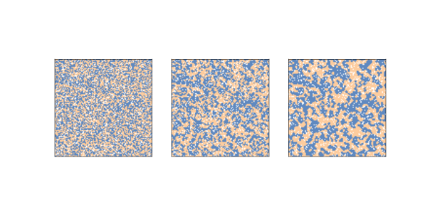
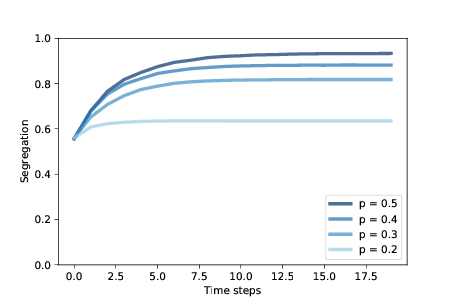

# 九、基于智能体的模型

我们迄今为止看到的模型可能具有“基于规则”的特征，因为它们涉及受简单规则支配的系统。 在本章和以后的章节中，我们将探索基于智能体（agent）的模型。

基于智能体的模型包含智能体，它旨在模拟人和其他实体，它们收集世界的信息，制定决策并采取行动。

智能体通常位于空间或网络中，并在本地彼此交互。 他们通常有不完整的，不全面的世界信息。

智能体之间经常存在差异，而不像以前的所有模型，它们的所有成分都相同。 基于智能体的模型通常包含智能体之间，或世界中的随机性。

自 20 世纪 70 年代以来，基于智能体的模型已成为经济学和其他社会科学，以及一些自然科学中的重要工具。

基于智能体的模型对非均衡系统的动态建模（尽管它们也用于研究均衡系统）非常有用。 它们对于理解个人决策和系统行为之间的关系特别有用。

本章的代码位于`chap09.ipynb`中，它是本书仓库中的 Jupyter 笔记本。 使用此代码的更多信息，请参见第？节。

## 9.1 谢林模型

1971 年，托马斯谢（Thomas Schelling）发表了《隔离的动态模型》（Dynamic Models of Segregation），该模型提出了种族隔离的简单模型。 谢林模型的世界是一个网格；每个细胞代表一栋房子。 房屋被两种智能体占用，标记为红色和蓝色，数量大致相同。 大约 10% 的房屋是空的。

在任何时候，智能体可能会高兴或不高兴，这取决于领域中的其他智能体，每个房屋的“邻居”是八个相邻细胞的集合。在一个版本的模型中，如果智能体至少有两个像他们一样的邻居，代理人会高兴，但如果是一个或零，他们就会不高兴。

模拟的过程是，随机选择一个智能体并检查他们是否高兴。 如果是这样，没有任何事情发生。如果不是，智能体随机选择其中一个未占用的细胞并移动。

听到这种模型导致一些隔离，你可能不会感到惊讶，但是你可能会对这个程度感到惊讶。 很快，会出现相似智能体的群落。 随着时间的推移，这些群落会不断聚合，直到有少量的大型群落，并且大多数智能体生活在同质社区中。

如果你不知道这个过程，只看到结果，你可能会认为智能体是种族主义者，但实际上他们都会在一个混合的社区感到非常高兴。 由于他们不愿意数量过大，所以在最坏的情况下，他们可能被认为是排外的。 当然，这些智能体是真实人物的过度简化，所以这些描述可能根本不恰当。

种族主义是一个复杂的人类问题; 很难想象这样简单的模型可以揭示它。 但实际上，它提供了一个强有力论据，有关系统及其各部分之间关系的：如果你观察真实城市的隔离，你不能总结为，个人的种族主义是直接原因，或者，城市居民是种族主义者。

当然，我们必须牢记这个论述的局限性：谢林模型证明了隔离的一个可能原因，但没有提到实际原因。

## 9.2 谢林模型的实现

为了实现谢林模型，我编写了另一个继承`Cell2D`的类：

```py

class Schelling(Cell2D):

    def __init__(self, n, m=None, p=0.5):
        self.p = p
        m = n if m is None else m
        choices = [0, 1, 2]
        probs = [0.1, 0.45, 0.45]
        self.array = np.random.choice(choices, (n, m), p=probs)
```

参数`n`和`m`是网格的维度，`p`是相似邻居比例的阈值。 例如，如果`p = 0.5`，也就是其邻居中少于 50% 为相同颜色，则代理将不高兴。

`array`是 NumPy 数组，其中每个细胞如果为空，则为 0；如果由红色智能体占用，则为1；如果由蓝色智能体占用，则为 2。 最初，10% 的细胞是空的，45% 为红色和 45% 为蓝色。

谢林模型的`step`函数比以前的`step`函数复杂得多。 如果你对细节不感兴趣，你可以跳到下一节。 但是如果你坚持要看，你可能需要一些 NumPy 的提示。

首先，我将生成逻辑数组，表明哪些细胞是红色，蓝色和占用的：

```py

a = self.array
red = a==1
blue = a==2
occupied = a!=0
```

我将使用`np.correlate2d`来计算，对于每个细胞，红色相邻细胞的数量和被占用的细胞数量。

```py
options = dict(mode='same', boundary='wrap')

kernel = np.array([[1, 1, 1],
                   [1, 0, 1],
                   [1, 1, 1]], dtype=np.int8)

num_red = correlate2d(red, kernel, **options)
num_neighbors = correlate2d(occupied, kernel, **options)
```

现在对于每个细胞，我们可以计算出红色的邻居比例和相同颜色的比例：

```py

frac_red = num_red / num_neighbors
frac_blue = 1 - frac_red
frac_same = np.where(red, frac_red, frac_blue)
```

`frac_red`只是`num_red`和`num_neighbors`的比率，而`frac_blue`是`frac_red`的补。

`frac_same`有点复杂。 函数`np.where`就像逐元素的`if`表达式一样。 第一个参数是从第二个或第三个参数中选择元素的条件。


在这种情况下，如果`red`为`True`，`frac_same`获取`frac_red`的相应元素。 在红色为`False`的情况下，`frac_same`获取`frac_blue`的相应元素。

现在我们可以确定不满意的智能体的位置：

```py
unhappy_locs = locs_where(occupied & (frac_same < self.p))
```

结果`unhappy_locs`是一个 NumPy 数组，其中每行都是占用的细胞的坐标，其中`frac_same`低于阈值`p`。

`locs_where `是`np.nonzero`的包装函数：

```py
def locs_where(condition):
    return np.transpose(np.nonzero(condition))
```

`np.nonzero`接受一个数组并返回所有非零元素的坐标，但结果是两个元组的形式。 `np.transpose`将结果转换为更有用的形式，即每行都是坐标对的数组。

同样，`empty_locs`是一个数组，包含空细胞的坐标：

```py
empty_locs = locs_where(a==0)
```

现在我们到达了模拟的核心。 我们遍历不高兴的智能体并移动它们：

```py
for source in unhappy_locs:
    i = np.random.randint(len(empty_locs))
    dest = tuple(empty_locs[i])
    a[dest] = a[tuple(source)]
    a[tuple(source)] = 0
    empty_locs[i] = source
```

`i`是一个用来随机选择空细胞的索引。

`dest`是一个包含空细胞的坐标的元组。

为了移动智能体，我们将值从`source`复制到`dest`，然后将`source`的值设置为 0（因为它现在是空的）。

最后，我们用`source`替换`empty_locs`中的条目，以便刚刚变为空的细胞可以由下一个智能体选择。

## 9.3 隔离



图 9.1：谢林的隔离模型，`n = 100`，初始条件（左），2 步后（中）和 10 步后（右）

现在让我们看看我们运行模型时会发生什么。 我将以`n = 100`和`p = 0.3`开始，并运行 10 个步骤。

```py
grid = Schelling(n=100, p=0.3)
for i in range(10):
    grid.step()
```

图？展示了初始状态（左），2 步（中）后和 10 步（右）后的模拟。

群落迅速形成，红色和蓝色的智能体移动到隔离集群中，它们由空细胞的边界分隔。

对于每种状态，我们可以计算隔离度，它是相同颜色的邻居的比例。在所有细胞中的平均值：

```py
np.sum(frac_same) / np.sum(occupied)
```

在图？中，相似邻居的比例均值在初始状态中为 55%，两步后为 71%，10 步后为 80%！

请记住，当`p = 0.3`时，如果 8 个邻居中的 3 个是他们自己的颜色，那么智能体会很高兴，但他们最终居住在一个社区中，其中 6 或 7 个邻居是自己的颜色。



图 9.2：随着时间的推移，谢林模型中的隔离程度，范围为`p`

图？显示了隔离程度如何增加，以及它在几个`p`值下的平稳位置。 当`p = 0.4`时，稳定状态下的隔离程度约为 88%，且大多数智能体没有不同颜色的邻居。

这些结果令许多人感到惊讶，它们成为了个人决策与系统行为之间的，复杂且不可预测的关系的鲜明示例。
