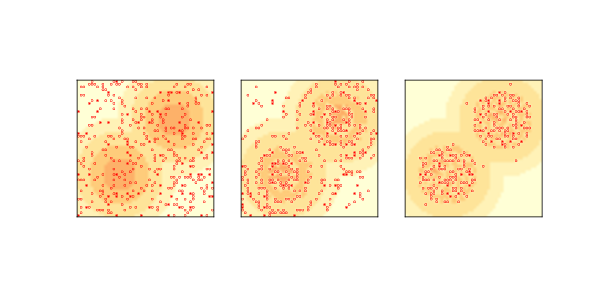
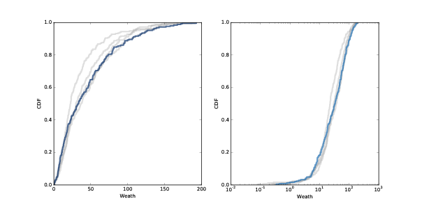
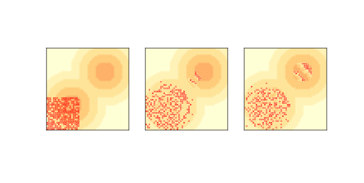

# 九、基于智能体的模型

> 原文：[Chapter 9  Agent-based models](http://greenteapress.com/complexity2/html/thinkcomplexity2010.html)

> 译者：[飞龙](https://github.com/wizardforcel)

> 协议：[CC BY-NC-SA 4.0](http://creativecommons.org/licenses/by-nc-sa/4.0/)

> 自豪地采用[谷歌翻译](https://translate.google.cn/)

我们迄今为止看到的模型可能具有“基于规则”的特征，因为它们涉及受简单规则支配的系统。 在本章和以后的章节中，我们将探索基于智能体（agent）的模型。

基于智能体的模型包含智能体，它旨在模拟人和其他实体，它们收集世界的信息，制定决策并采取行动。

智能体通常位于空间或网络中，并在本地彼此交互。 他们通常有不完整的，不全面的世界信息。

智能体之间经常存在差异，而不像以前的所有模型，它们的所有成分都相同。 基于智能体的模型通常包含智能体之间，或世界中的随机性。

自 20 世纪 70 年代以来，基于智能体的模型已成为经济学和其他社会科学，以及一些自然科学中的重要工具。

基于智能体的模型对非均衡系统的动态建模（尽管它们也用于研究均衡系统）非常有用。 它们对于理解个人决策和系统行为之间的关系特别有用。

本章的代码位于`chap09.ipynb`中，它是本书仓库中的 Jupyter 笔记本。 使用此代码的更多信息，请参见第？节。

## 9.1 谢林模型

1971 年，托马斯谢（Thomas Schelling）发表了《隔离的动态模型》（Dynamic Models of Segregation），该模型提出了种族隔离的简单模型。 谢林模型的世界是一个网格；每个细胞代表一栋房子。 房屋被两种智能体占用，标记为红色和蓝色，数量大致相同。 大约 10% 的房屋是空的。

在任何时候，智能体可能会高兴或不高兴，这取决于领域中的其他智能体，每个房屋的“邻居”是八个相邻细胞的集合。在一个版本的模型中，如果智能体至少有两个像他们一样的邻居，智能体会高兴，但如果是一个或零，他们就会不高兴。

模拟的过程是，随机选择一个智能体并检查他们是否高兴。 如果是这样，没有任何事情发生。如果不是，智能体随机选择其中一个未占用的细胞并移动。

听到这种模型导致一些隔离，你可能不会感到惊讶，但是你可能会对这个程度感到惊讶。 很快，会出现相似智能体的群落。 随着时间的推移，这些群落会不断聚合，直到有少量的大型群落，并且大多数智能体生活在同质社区中。

如果你不知道这个过程，只看到结果，你可能会认为智能体是种族主义者，但实际上他们都会在一个混合的社区感到非常高兴。 由于他们不愿意数量过大，所以在最坏的情况下，他们可能被认为是排外的。 当然，这些智能体是真实人物的过度简化，所以这些描述可能根本不恰当。

种族主义是一个复杂的人类问题; 很难想象这样简单的模型可以揭示它。 但实际上，它提供了一个强有力论据，有关系统及其各部分之间关系的：如果你观察真实城市的隔离，你不能总结为，个人的种族主义是直接原因，或者，城市居民是种族主义者。

当然，我们必须牢记这个论述的局限性：谢林模型证明了隔离的一个可能原因，但没有提到实际原因。

## 9.2 谢林模型的实现

为了实现谢林模型，我编写了另一个继承`Cell2D`的类：

```py

class Schelling(Cell2D):

    def __init__(self, n, m=None, p=0.5):
        self.p = p
        m = n if m is None else m
        choices = [0, 1, 2]
        probs = [0.1, 0.45, 0.45]
        self.array = np.random.choice(choices, (n, m), p=probs)
```

参数`n`和`m`是网格的维度，`p`是相似邻居比例的阈值。 例如，如果`p = 0.5`，也就是其邻居中少于 50% 为相同颜色，则智能体将不高兴。

`array`是 NumPy 数组，其中每个细胞如果为空，则为 0；如果由红色智能体占用，则为1；如果由蓝色智能体占用，则为 2。 最初，10% 的细胞是空的，45% 为红色和 45% 为蓝色。

谢林模型的`step`函数比以前的`step`函数复杂得多。 如果你对细节不感兴趣，你可以跳到下一节。 但是如果你坚持要看，你可能需要一些 NumPy 的提示。

首先，我将生成逻辑数组，表明哪些细胞是红色，蓝色和占用的：

```py

a = self.array
red = a==1
blue = a==2
occupied = a!=0
```

我将使用`np.correlate2d`来计算，对于每个细胞，红色相邻细胞的数量和被占用的细胞数量。

```py
options = dict(mode='same', boundary='wrap')

kernel = np.array([[1, 1, 1],
                   [1, 0, 1],
                   [1, 1, 1]], dtype=np.int8)

num_red = correlate2d(red, kernel, **options)
num_neighbors = correlate2d(occupied, kernel, **options)
```

现在对于每个细胞，我们可以计算出红色的邻居比例和相同颜色的比例：

```py

frac_red = num_red / num_neighbors
frac_blue = 1 - frac_red
frac_same = np.where(red, frac_red, frac_blue)
```

`frac_red`只是`num_red`和`num_neighbors`的比率，而`frac_blue`是`frac_red`的补。

`frac_same`有点复杂。 函数`np.where`就像逐元素的`if`表达式一样。 第一个参数是从第二个或第三个参数中选择元素的条件。


在这种情况下，如果`red`为`True`，`frac_same`获取`frac_red`的相应元素。 在红色为`False`的情况下，`frac_same`获取`frac_blue`的相应元素。

现在我们可以确定不满意的智能体的位置：

```py
unhappy_locs = locs_where(occupied & (frac_same < self.p))
```

结果`unhappy_locs`是一个 NumPy 数组，其中每行都是占用的细胞的坐标，其中`frac_same`低于阈值`p`。

`locs_where `是`np.nonzero`的包装函数：

```py
def locs_where(condition):
    return np.transpose(np.nonzero(condition))
```

`np.nonzero`接受一个数组并返回所有非零元素的坐标，但结果是两个元组的形式。 `np.transpose`将结果转换为更有用的形式，即每行都是坐标对的数组。

同样，`empty_locs`是一个数组，包含空细胞的坐标：

```py
empty_locs = locs_where(a==0)
```

现在我们到达了模拟的核心。 我们遍历不高兴的智能体并移动它们：

```py
for source in unhappy_locs:
    i = np.random.randint(len(empty_locs))
    dest = tuple(empty_locs[i])
    a[dest] = a[tuple(source)]
    a[tuple(source)] = 0
    empty_locs[i] = source
```

`i`是一个用来随机选择空细胞的索引。

`dest`是一个包含空细胞的坐标的元组。

为了移动智能体，我们将值从`source`复制到`dest`，然后将`source`的值设置为 0（因为它现在是空的）。

最后，我们用`source`替换`empty_locs`中的条目，以便刚刚变为空的细胞可以由下一个智能体选择。

## 9.3 隔离


图 9.1：谢林的隔离模型，`n = 100`，初始条件（左），2 步后（中）和 10 步后（右）

现在让我们看看我们运行模型时会发生什么。 我将以`n = 100`和`p = 0.3`开始，并运行 10 个步骤。

```py
grid = Schelling(n=100, p=0.3)
for i in range(10):
    grid.step()
```

图？展示了初始状态（左），2 步（中）后和 10 步（右）后的模拟。

群落迅速形成，红色和蓝色的智能体移动到隔离集群中，它们由空细胞的边界分隔。

对于每种状态，我们可以计算隔离度，它是相同颜色的邻居的比例。在所有细胞中的平均值：

```py
np.sum(frac_same) / np.sum(occupied)
```

在图？中，相似邻居的比例均值在初始状态中为 55%，两步后为 71%，10 步后为 80%！

请记住，当`p = 0.3`时，如果 8 个邻居中的 3 个是他们自己的颜色，那么智能体会很高兴，但他们最终居住在一个社区中，其中 6 或 7 个邻居是自己的颜色。


图 9.2：随着时间的推移，谢林模型中的隔离程度，范围为`p`

图？显示了隔离程度如何增加，以及它在几个`p`值下的平稳位置。 当`p = 0.4`时，稳定状态下的隔离程度约为 88%，且大多数智能体没有不同颜色的邻居。

这些结果令许多人感到惊讶，它们成为了个人决策与系统行为之间的，复杂且不可预测的关系的鲜明示例。

## 9.4 糖域

1996年，约书亚爱泼斯坦（Joshua Epstein）和罗伯特阿克斯特尔（Robert Axtell）提出了糖域（Sugarscape），这是一个“人造社会”的智能体模型，旨在支持经济学和其他社会科学的相关实验。

糖域是一款多功能的模型，适用于各种主题。 作为例子，我将复制 Epstein 和 Axtell 的书《Growing Artificial Societies》的前几个实验。

糖域最简单的形式是一个简单的经济模型，智能体在二维网格上移动，收集和累积代表经济财富的“糖”。 网格的一些部分比其他部分产生更多的糖，并且一些智能体比其他人更容易找到它。

这个糖域的版本常用于探索和解释财富的分布，特别是不平等的趋势。

在糖域的网格中，每个细胞都有一个容量，这是它可容纳的最大糖量。 在原始状态中，有两个高糖区域，容量为 4，周围是同心环，容量分别为 3, 2 和 1。



图 9.3：原始糖域模型的复制品：初始状态（左），2 步后（中）和 100 步后（右）。

图？（左）展示了初始状态，最黑暗的区域表示容量最高的细胞，小圆圈表示智能体。

最初有随机放置的 400 个智能体。 每个智能体有三个随机选择的属性：

糖：

每个智能体最开始都有先天的糖分，从 5 到 25 之间均匀选择。

代谢：

在每个时间步骤中，每个智能体都必须消耗一定数量的糖，从 1 到 4 之间均匀选择。

视力：

每个智能体可以“看到”附近细胞中糖量，并移动到最多的细胞，但是与其它智能体相比，一些智能体可以看到更远的细胞。 智能体看到的距离从 1 和 6 之间均匀选择。

在每个时间步骤中，智能体以随机顺序一次移动一格。 每个智能体都遵循以下规则：

+   智能体在 4 个罗盘方向的每一个方向上调查`k`个细胞，其中`k`是智能体的视野范围。
+   它选择糖分最多的未占用的细胞。 在相等的情况下，选择较近的细胞；在距离相同的细胞中，它随机选择。
+   智能体移动到选定的细胞并收获糖分，将收获增加到其积累的财富并将细胞清空。
+   智能体根据代谢消耗其财富的一部分。 如果结果总量为负数，智能体“饿死”并被删除。

在所有智能体完成这些步骤之后，细胞恢复一些糖，通常为 1 单位，但每个细胞中的总糖分受其容量限制。

图？（中）显示两步后模型的状态。 大多数智能体正在移到糖最多的地区。 视力高的智能体移动速度最快；视力低的智能体往往会卡在高原上，随机游走，直到它们足够接近来看到下一个水平。

出生在糖分最少的地区的智能体可能会饿死，除非他们的视力很好，先天条件也很高。

在高糖地区，随着糖分的出现，智能体相互竞争，寻找和收获糖分。 消耗高或视力低的智能体最有可能挨饿。

当糖在每个时间步骤增加 1 个单位时，就没有足够的糖来维持我们开始的 400 个智能体。 人口起初迅速下降，然后缓慢下降，在大约 250 左右停下。

图？（右）显示了 100 个时间步后的模型状态，大约有 250 个智能体。 存活的智能体往往是幸运者，出生时视力高和/或代消耗低。 存活到这里的话，它们可能会永远存活，积累无限量的糖。

## 9.5 财富的不平等

在目前的形式下，糖域建立了一个简单的生态学模型，可用于探索模型参数之间的关系，如增长率和智能体的属性，以及系统的承载能力（在稳定状态下生存的智能体数量）。 它模拟了一种形式的自然选择的，“适应度”较高的智能体更有可能生存下来。

该模型还表现出一种财富不平等，一些智能体积累糖的速度比其他智能体快。 但是对于财富分布，很难说具体的事情，因为它不是“静止的”。 也就是说，分布随着时间的推移而变化并且不会达到稳定状态。

然而，如果我们给智能体有限的寿命，这个模型会产生固定的财富分布。 然后我们可以运行实验，来查看参数和规则对此分布的影响。

在这个版本的模型中，智能体的年龄在每个时间步增加，并且从 60 到 100 之间的均匀分布中，随机选择一个寿命。如果智能体的年龄超过其寿命，它就会死亡。

当智能体因饥饿或年老而死亡时，它由属性随机的新智能体所取代，所以总人口是不变的。



图 9.4：100, 200, 300 和 400 步（灰线）和 500 步（黑线）之后的糖（财富）的分布。 线性刻度（左）和对数刻度（右）。

从接近承载能力的 250 个智能体开始，我运行了 500 个步骤的模型。 在每 100 步之后，我绘制了智能体积累的糖的分布。 图？在线性刻度（左）和对数刻度（右）中展示结果。

经过大约 200 步（这是最长寿命的两倍）后，分布变化不大。 并且它向右倾斜。

大多数智能体积累的财富很少：第 25 百分位数大约是 10，中位数大约是 20。但是少数智能体积累了更多：第 75 百分位数是大约 40，最大值大于 150。

在对数刻度上，分布的形状类似于高斯或正态分布，但右尾被截断。 如果它在对数刻度上实际上是正态的，则分布是对数正态分布，这是一种重尾分布。 实际上，几乎每个国家和全世界的财富分布都是重尾分布。

如果说糖域解释了为什么财富分布是重尾的，但是糖域变化中的不平等的普遍性表明，不平等是许多经济体的特征，甚至是非常简单的经济体。 一些实验表明避免或减轻并不容易，它们带有一些规则，对纳税和其他收入转移进行建模。

## 9.6 实现糖域

糖域比以前的模型更复杂，所以我不会在这里介绍整个实现。 我将概述代码的结构，你可以在 Jupyter 笔记本`chap09.ipynb`中查看本章的细节，它位于本书的仓库中。 如果你对细节不感兴趣，你可以跳到下一节。

以下是带有`step`方法的`Agent`类：

```py

class Agent:

    def step(self, env):
        self.loc = env.look_around(self.loc, self.vision)
        self.sugar += env.harvest(self.loc) - self.metabolism
        self.age += 1
```

在每个步骤中，智能体移动，收获糖，并增加年龄。

参数`env`是环境的引用，它是一个`Sugarscape`对象。 它提供了方法`look_around`和收获：

+   `look_around`获取智能体的位置，这是一个坐标元组，以及智能体的视野，它是一个整数。 它返回智能体的新位置，这是糖分最多的可见细胞。
+   `harvest `需要智能体的（新）位置，并在移除并返回该位置的糖分。

这里是`Sugarscape`类和它的`step`方法（不需要替换）：

```py
class Sugarscape(Cell2D):

    def step(self):

        # loop through the agents in random order
        random_order = np.random.permutation(self.agents)
        for agent in random_order:

            # mark the current cell unoccupied
            self.occupied.remove(agent.loc)

            # execute one step
            agent.step(self)

            # if the agent is dead, remove from the list
            if agent.is_starving():
                self.agents.remove(agent)
            else:
                # otherwise mark its cell occupied
                self.occupied.add(agent.loc)

        # grow back some sugar
        self.grow()
        return len(self.agents)
```

`Sugarscape`继承自`Cell2D`，因此它与我们所见过的其他基于网格的模型相似。

这些属性包括`agents`，它是`Agent`对象的列表，以及`occupied`，它是一组元组，其中每个元组包含智能体占用的细胞的坐标。

在每个步骤中，`Sugarscape`以随机顺序遍历智能体。 它调用每个智能体的`step`，然后检查它是否已经死亡。 所有智能体都移动后，一些糖会恢复。

如果你有兴趣更加了解 NumPy ，你可能需要仔细看看`make_visible_locs`，它构建一个数组，其中每行包含智能体可见的细胞坐标，按距离排序，但距离相同的细胞 是随机顺序。

你可能想看看`Sugarscape.make_capacity`，它初始化细胞的容量。 它演示了`np.meshgrid`的使用，这通常很有用，但需要一些时间才能理解。

## 9.7 迁移和波动行为



图 9.5：`Sugarscape`中的波动行为：初始状态（左），6 步后（中）和 12 步后（右）

虽然`Sugarscape`的主要目的不是探索空间中的智能体的移动，但 Epstein 和 Axtell 在智能体迁移时，观察到一些有趣的模式。

如果我们开始把所有智能体放在左下角，他们会迅速走向最近的高容量细胞的“山峰”。 但是如果有更多的智能体，单个山峰不足以支持它们的话，他们很快就会耗尽糖分，智能体被迫进入低容量地区。

视野最长的那些，首先穿过山峰之间的山谷，并且像波一样向东北方向传播。 因为他们在身后留下一些空细胞，所以其他智能体不会追随，直到糖分恢复。

结果是一系列离散的迁移波，每个波都像一个连贯的物体，就像我们在规则 110 CA 和生命游戏中看到的飞船（参见第？节）。

图？显示了初始条件下（左），6 个步骤（中）和 12 个步骤（右）之后的模型状态。 你可以看到，前两个波到达并穿过第二个山峰，留下了一串空细胞。 你还可以看到这个模型的动画版本，其中波形更清晰可见。

虽然这些波动由智能体组成，但我们可以将他们视为自己的实体，就像我们在“生命游戏”中想到的滑翔机一样。

这些波动的一个有趣的属性是，它们沿对角线移动，这可能是令人惊讶的，因为这些智能体本身只是向北或向东移动，从不向东北方移动。 像这样的结果 - 团队或“集合”拥有智能体没有的属性和行为 - 在基于智能体的模型中很常见。 我们将在下一章看到更多的例子。

## 9.8 涌现

本章中的例子展示了复杂性科学中最重要的想法之一：涌现。 涌现性是系统的一个特征，由它的成分相互作用而产生，而不是它们的属性。


为了澄清什么是涌现，考虑它不是什么会有帮助。 例如，砖墙很硬，因为砖和砂浆很硬，所以这不是涌现。 再举一个例子，一些刚性结构是由柔性部件构成的，所以这看起来像是一种涌现。 但它至多是一种弱例，因为结构特性遵循已知的力学定律。


相反，我们在谢林模型中看到的隔离是一种涌现，因为它不是由种族主义智能体造成的。 即使智能体只是轻微排外，系统的结果与智能体的决策意图有很大不同。

糖域中的财富分配可能是涌现，但它是一个弱例，因为我们可以根据视力，代谢和寿命的分布合理预测它。 我们在最后一个例子中看到的波动行为可能是一个更强的例子，因为波动显示出智能体显然没有的能力 - 对角线运动。

涌现性令人惊讶：即使我们知道所有规则，也很难预测系统的行为。难度不是偶然的；事实上，它可能是涌现的决定性特征。

正如沃尔夫勒姆在“新科学”中所讨论的那样，传统科学是基于这样的公理：如果你知道管理系统的规则，那么你可以预测它的行为。 我们所谓的“法律”通常是计算的捷径，它使我们能够预测系统的结果而不用建立或观察它。

但是许多细胞自动机在计算上是不可减少的，这意味着没有捷径。 获得结果的唯一方法是实现该系统。

一般而言，复杂系统可能也是如此。 对于具有多个成分的物理系统，通常没有产生解析解的模型。 数值方法提供了一种计算捷径，但仍存在质的差异。

解析解通常提供用于预测的恒定时间算法；也就是说，计算的运行时间不取决于预测的时间尺度`t`。 但数值方法，模拟，模拟计算和类似方法需要的时间与`t`成正比。 对于许多系统来说，我们无法计算出可靠的预测。

这些观察表明，涌现性基本上是不可预测的，对于复杂系统我们不应该期望，通过计算捷径来找到自然规律。

对某些人来说，“涌现”是无知的另一个名字; 根据这种思维，如果我们针对它没有还原论的解释，那么这个属性就是涌现的，但如果我们在将来更好地理解它，它就不再是涌现的。

涌现性的状况是有争议的话题，所以对此持怀疑态度是恰当的。 当我们看到明显的涌现性时，我们不应该假设永远不会有还原论解释。但我们也不应该假设必须有。

本书中的例子和计算等价原理提供了很好的理由，认为至少有些涌现性永远不会被古典还原论模型“解释”。

你可以在这里更加了解涌现：<http://en.wikipedia.org/wiki/Emergence>。

## 9.9 练习

练习 1

本章的代码位于本书仓库的 Jupyter 笔记本`chap09.ipynb`中。打开这个笔记本，阅读代码，然后运行单元格。你可以使用这个笔记本来练习本章的练习。我的解决方案在`chap09soln.ipynb`中。

练习 2

《The Big Sort》的作者 Bill Bishop 认为，美国社会越来越由政见所隔离，因为人们选择生活在志趣相投的邻居之中。

Bishop 所假设的机制并不是像谢林模型中的智能体那样，如果他们是孤立的，他们更有可能移动，但是当他们出于任何原因移动时，他们可能会选择一个社区，其中的人与他们自己一样。

修改谢林模型的实现来模拟这种行为，看看它是否会产生类似程度的隔离。

有几种方法可以模拟 Bishop 的假设。在我的实现中，随机选择的智能体会在每个步骤中移动。每个智能体考虑`k`个随机选择的空位置，并选择相似邻居的比例最高的位置。隔离程度和`k`有什么关系？

练习 3

在糖域的第一个版本中，我们从不添加智能体，所以一旦人口下降，它就不会恢复。 在第二个版本中，我们只是在智能体死亡时才取代，所以人口是不变的。 现在让我们看看如果我们增加一些“人口压力”会发生什么。

编写糖域的一个版本，在每一步结束时添加一个新的智能体。 添加代码来计算每个步骤结束时，智能体的平均视力和平均消耗。 运行模型几百步，绘制人口，平均视力和平均消耗随时间的变化。

你应该能够通过继承`SugarScape`并覆盖`__init__`和`step`来实现这个模型。

练习 4

在心灵哲学中，强人工智能是这样的理论，即受到适当编程的计算机可以拥有思想，与人类拥有的思想相同。

约翰·塞尔（John Searle）提出了一个名为“中文房间”的思想实验，旨在表明强 AI 是虚假的。 你可以在 <http://en.wikipedia.org/wiki/Chinese_room> 上阅读。

对中文房间的论述的系统回复是什么？ 你对涌现的认识如何影响你对系统回复的反应？
